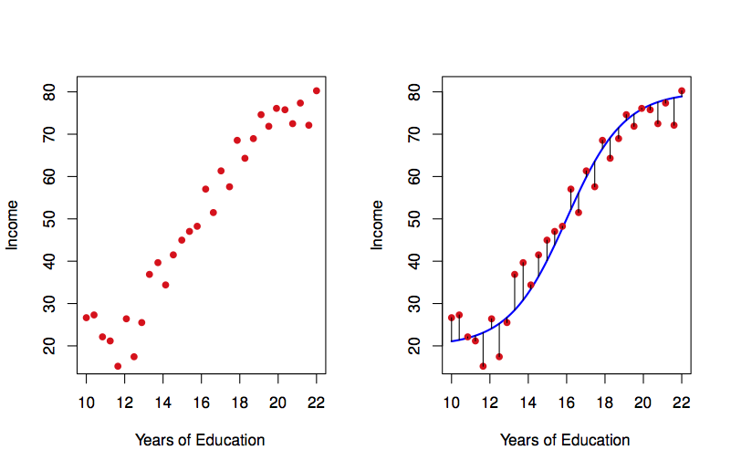
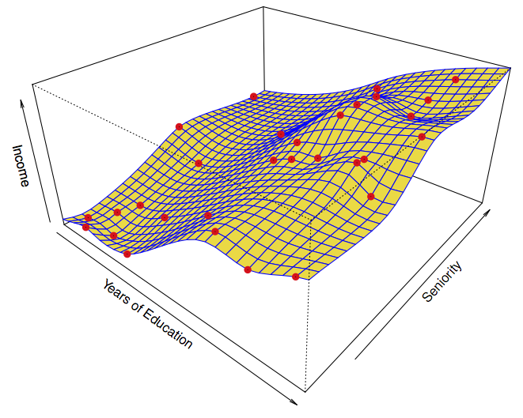
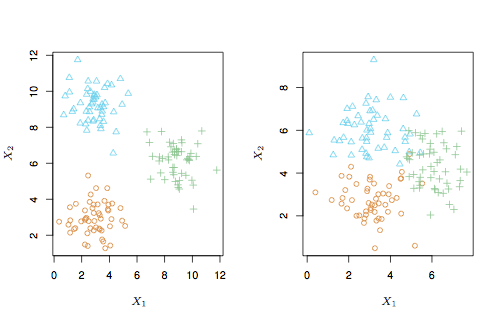
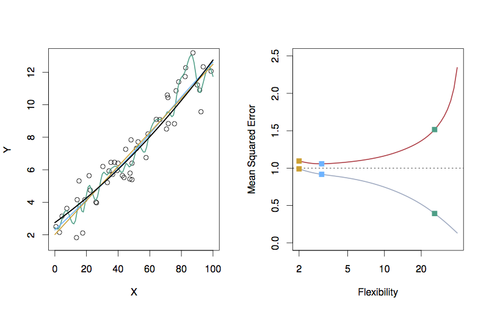

* Subjects
    * Overview of statistical learning.
    * Getting started with R, RStudio, and RMarkdown
* Reading: Chapter 2 of ISL
* Programming basics 1: Names, classes, and objects

```{r include = FALSE}
library(mosaic)
```

## Statistical and Machine Learning

The two terms, "statistical learning" and "machine learning," reflect mainly the artificialities of academic disciplines.

* Statisticians focus on the statistical aspects of the problems
* Computer scientists are interested in "machines", including hardware and software.

"Data Science" is a new term that reflects the reality that both statistical and machine learning are about data.  Techniques and concepts from both statistics and computer science are essential.


    
### Example 1: Machine translation of natural languages

Computer scientists took this on.    

* Identification of grammatical structures and tagging text.
* Dictionaries of single-word equivalents, common phrases.

[Story from early days of machine translation](https://en.wikipedia.org/wiki/Literal_translation):   

* Start with English: "The spirit is willing, but the flesh is weak." <!-- (Russian equivalent: дух бодр, плоть же немощна) -->
* Translate into Russian <!-- somehow getting водка хорошая, но мясо протухло.-->
* Translate back into English. Result: "The vodka is good, but the meat is rotten."  

Statistical approach:  

* Take a large sample of short phrases in language A and their human translation into language B: the dictionary
* Find simple measures of similarity between phrases in language A (e.g. de-stemmed words in common)
* Take new phrase in language A, look up it's closest match in the dictionary phrases in language A.  Translation is the corresponding dictionary entry in language B

Where did the sample of phrases come from?

* European Union documents routinely translated into all the member languages.  Humans mark correspondence.
* "Mechanical Turk" dispersal of small work tasks.

Result: Google translate.

### Example 2: From library catalogs to latent semantic indexing

Early days: computer systems with key words and search systems (as in library catalogs)

Now: dimension reduction (e.g. singular value decomposition), angle between specific documents and what might be called "eigen-documents"

Result: Google search

### Computing technique

Each student in the class as a personal repository on GitHub. The instructor is also a contributor to this repository and can see anything in it. Complete instructions for doing this are in the appendix.

1. Set up some communications and security systems (e.g. an RSA key)
2. Clone your repository from GitHub. It is at an address like `github.com/dtkaplan/math253-bobama`.

[Day 1 Programming Activity](../../ProgrammingActivities/Day-01-Programming-Task.html)


## Review of Day 1

We discussed what "machine learning" means and saw some examples of situations where machine-learning techniques have been used successfully to solve problems that had at best clumbsy solutions before. (Natural language translation, catalogs of large collections of documents.)

We worked through the process of connecting RStudio to GitHub, so that you can use your personal repository for organizing, backing up, and handing in your work.

The Day-1 programming activity introduced some basic components of R: assignments, strings, vectors, etc.

## Theoretical concepts ISL §2.1

"Data science" lies at the intersection of statistics and computer science.

### Statistics concepts

* Sampling variability
* Bias and variance
* Characterization of precision
* Function estimation frameworks, e.g. generalized linear models
* Assumed probability models
* Prior and posterior probabilities (Bayesian framework)

### Computing concepts

* Algorithms 
* Iteration
* Simulation
* Function estimation frameworks, e.g. classification trees, support vector machines, artificial intelligence techniques
* Kalman filters

### Cross fertilization

* Assumed probability models supplanted by simulation
    * Randomization and iteration
    * Cross validation
    * Bootstrapping
* Model interpretibility
    Rather than an emphasis on the output of a function, interest in what the function has to say about how the world works.
    
## Many techniques 

"Learning" is an attractive word and suggests that "machine learning" is an equivalent for what humans do. Perhaps it is to some extent ...

But "modeling" is a more precise term. We will be building models of various aspects of the world based on data.

* Model: A representation for a purpose. Blueprints, dolls, model airplanes.
* Mathematical model: A model built of mathematical stuff
    - polynomials: Math 155
    - functions more generally: e.g. splines, smoothers, ...
    - trees
    - geometry of distance: e.g. which exemplar are the inputs closest to?
    - projection onto subspaces
* Statistical model: A mathematical model founded on data. 

### Unsupervised learning

Wait until the end of the semester.

We will be doing only supervised learning until late in the course.
    
### Supervised learning: 
    
* We have a set of cases, $i = 1, 2, 3, \ldots, n$, called the **training data**. 
* For each case, we have an input ${\mathbf X_i}$ consisting potentially of several variables measured on that case.
    - The subscript $i$ in ${\mathbf X_i}$ means that we have one ${\mathbf X}$ for each case.  The boldface ${\bf X}$ means that the input can be multi-dimensional, that is, consisting of multiple variables.  
* For each case, we have an output $Y_i$.
* We want to learn the overall pattern of the relationship between the inputs ${\mathbf X}$ and the outputs $Y$, not just for our $n$ training cases, but for potential cases that we have not encountered yet. These as yet unencountered cases are thought of as the **testing data**. 
* We are going to represent the pattern with a **function** $\hat{f} : {\bf X} \rightarrow Y$.  
* Sometimes I'll use the word **model** instead of function.  A model is a representation for a purpose.  A function is a kind of representation.  So some models involve functions.  That's the kind we'll focus on in this course.  I say "model" out of habit, but it's a good habit that reminds us that the **purpose** of the function is important and we should know what that purpose is when we undertake learning.
    


    
## Basic dicotomies in machine learning

There are fundamental trade-offs that describe the structure of learning from data. There are also trade-offs that arise between different methods of learning. Finally, there are dicotomies that stem from the different purposes for learning.

These dicotomies provide a kind of road map to tell you where are are and identify where you might want to go.

And, as always, it's important to know why you are doing what you're doing: your purpose.

### Purposes for learning:

* Make predictions. Given new inputs, e.g. data about an event, predict what the result of the event will be. e.g. weather forecasting, credit card fraud, success in college, .... In statistics, this is sometimes thought of as "analyzing data from an observational study."
* Anticipate the effects of an intervention that we impose, e.g., giving a patient a drug, changing funding for schools, ... Traditionally in statistics, this has been tied exclusively to data from experiments. There is now greater acceptance that experiments are not always possible, and it's important to be able to make reasonable inferences about causation from observational studies.
* Find structure in a mass of data.


### Dicotomies

* make predictions vs capture causal mechanism (in this course: common sense. There are also formal techniques to guide causal reasoning.)
* flexibility vs variance (need some tools for this)
* black box vs interpretable models (comparing model architectures)
* reducible vs irreducible error ("bias" vs "residuals")
* regression vs classification (easy!)
* supervised vs unsupervised learning (easy!)

### Prediction versus mechanism


Example: Malignancy of cancer from appearance of cells.  Works for guiding treatment. Does it matter why malignant cells have the appearance they do?

Story: Mid-1980s. Heart rate variability spectral analysis and holter monitors. (Holters were cassette tape recorders set to record ECG very, very slowly. Spectral analysis breaks down the overal signal into periodic components.) Very large spike at 0.03 Hz seen in people who will soon die.  

Could use for prediction, but researchers were also interested in the underlying physiological mechanism.  Causal influences.  We want to use observations to inform our understanding of what influences what.

Story continued: The very large spike was the "wow and flutter" in the cassette tape mechanism. This had an exact periodicity: a spike in the spectrum. If the person was sick, their heart rate was steady: they had no capacity to vary it as other conditions in the body (arterial compliance, venus tone) called for.  Understanding what happens in cardiac illness is, in part, about understanding how the various control systems interact.

### Flexibility versus variance

In traditional statistics, this is often tied up with the concept of "degrees of freedom."

Not flexible:

```{r ISL-2-1, echo = FALSE, fig.cap = "Individual fits miss how the explanatory variables interact. ISL Figure 2.1"}
knitr::include_graphics("Images/Chapter-2/2.1.png")
```

Flexible:

```{r ISL-2-2, echo = FALSE, fig.cap = "Such detailed patterns are more closely associated with physical science data than with social/economic data. ISL Figure 2.2"}

```


And in multiple variables:

**Not flexible**:

```{r ISL-2-4, echo = FALSE, fig.cap = "ISL Figure 2.4"}
knitr::include_graphics("Images/Chapter-2/2.4.png")
```

**Flexible**:

```{r ISL-2-6, echo = FALSE, fig.cap = "ISL Figure 2.6"}

```


### Black box vs interpretable models

Many learning techniques produce models that are not easily interpreted in terms of the working of the system. Examples: neural networks, random forests, etc. The role of input variables is implicit. Characterizing it requires experimenting on the model. 
In other learning techniques, the role of the various inputs and their interactions is explicit (e.g. model coefficients).

The reason to use a black-box model is that it can be flexible. So this tradeoff might be called "flexibility vs interpretability."

A quick characterization of several model architectures (which they call "statistical learning methods")

```{r ISL-2-7, echo = FALSE, fig.cap = "ISL Figure 2.7"}
knitr::include_graphics("Images/Chapter-2/2.7.png")
```


### Reducible versus irreducible error

How good can we make a model? How do we describe how good it is?

What does this mean?  (from p. 19)

$$\begin{array}{rcl}
E(Y - \hat{Y})^2 & = & E[f(X) + \epsilon - \hat{f}(X)]^2\\
                 & = & \underbrace{[f(X) - \hat{f}(X)]^2}_{Reducible} + \underbrace{Var(\epsilon)}_{Irreducible}\\
                 \end{array}$$
                 
Notation:

* $X$ --- the inputs that determine the output $Y$.
* $Y$ --- the output, that is, the quantity we want to predict
* $\hat{Y}$ --- our prediction
    * hat means estimated, no hat means "real" (whatever that might mean)
* $E(Y - \hat{Y})^2$ --- the mean of the square difference between our prediction and the "real" value. $E$ means "expectation value."
* $f(X)$ --- what $Y$ would be, ideally, for a given $X$
* $\hat{f}(X)$ --- our estimate of $f(X)$
* $\epsilon$ --- but $Y$ is subject to other, "random" influences.  $\epsilon$ represents these.  $\epsilon$ is a misleading notation because it may not be at all small in practice.  But $\epsilon$ is alway centered on zero (by definition).
* $|f(X) - \hat{f}(X)|$ --- the magnitude of the difference between the "real" $f()$ and our estimate.  This can be made small by 
    1. collecting more data
    2. using a more flexible model
    3. expanding the set of inputs considered
* $Var(\epsilon)$ --- the "variance" of $\epsilon$.  This is the mean square of $\epsilon$, that is, $E(\epsilon^2)$.

### Regression versus classification

Regression: quantitative response (value, probability, count, ...)

Classification: categorical response with more than two categories. (When there are just two categories, regression (e.g. logistic regression) does the job.)  

### Supervised versus unsupervised

* Demographics groups in marketing.
* Poverty vs middle-class
* Political beliefs ... left vs right?

```{r ISL-2-8, echo = FALSE, fig.cap = "ISL Figure 2.8"}

```

## Programming Activity 1

[Using R/Markdown](../ProgrammingActivities/Day-01-Programming.html)

## Review of Day 2

### Trade-offs/Dicotomies

* Regression vs classification    
    - Different kinds of functions. A classifier has output as a categorical level.  A regression has output as a number.
    - Many classifiers are arranged to produce as output a set of numbers: the probability of each of the possible levels of the categorical output. When there are just two such levels, only one probability is needed. (The other is simply $(1-p)$.) So for two-level classifiers, there's not necessarily a distinction between regression and classification. Thus, "logistic regression."
    
* Supervised vs unsupervised learning
    - In supervised learning, with have an output (response variable) $Y$ which we want to generate from input $\mathbf{X}$. We train a function $\hat{f}: \mathbf{X} \rightarrow Y$  
    - In unsupervised learning, there is no identified response variable. Instead of modeling the response as a function of $\mathbf{X}$, we look for patterns within $\mathbf{X}$.

* Prediction vs causal mechanism    
    * Two different kinds of purpose.  There may well be different kinds of functions best suited to each purpose.
    
* Accuracy (flexibility) vs interpretability    
    We always want models to be accurate.  Whether we need to be able to interpret the model depends on our overall purpose.
    
* Reducible error vs irreducible error    
    It's good to know how accurate our models can get.  That gives a goal for trying out different types of models to know when we don't need to keep searching.

## A Classifier example 

A classification setting: Blood cell counts.

Build a machine which takes a small blood sample and examines and classifies individual white blood cells.

```{r blood-cells, echo = FALSE, fig.cap = "Blood cell classification"}
knitr::include_graphics("Images/blood-cells.png")
```

The classification is to be based on two measured inputs, shown on the x- and y-axes.

Training data has been developed where the cell was classified "by hand." In medicine, this is sometimes called the *gold standard*.  The gold standard is sometimes not very accurate.  Here, each cell is one dot.  The color is the type of the cell: granulocytes, lymphocytes, monocytes, ...

## Programming Activity 2

[Some basics with data](../ProgrammingActivities/Day-02-Programming.html)

## Day 3 theory: accuracy, precision, and bias

### Figure 2.10 

In constructing a theory, it's good to have a system you can play with where you know exactly what is going on: e.g. a simulation.

The dark blue line in the left panel is a function the authors created for use in a simulation:

```{r ISL-2-9, echo = FALSE, fig.cap = "ISL Figure 2.9"}
knitr::include_graphics("Images/Chapter-2/2.9.png")
```

The dots are data the textbook authors generated from evaluating the function at a few dozen values of $x$ and adding noise to each result.

The difference between the dots' vertical position and the function value is the *residual*, which they are calling the *error*.  The mean square error MSE is

$$\mbox{MSE} = \frac{1}{n} \sum_{i=1}^n (y_i - f(x_i))^2$$

* Take this notation apart.  What's $n$? What's $i$? 
* Suppose that $f(x)$ were constant.  In that situation, what kind of statistical quantity does this resemble?
* In actual practice, we don't know $f(x)$. (Indeed, it's a matter of philosophy whether this is an $f(x)$ --- it's a kind of Platonic form.)  Here we know $f(x)$ because we are playing a game: running a simulation.

Looking again at the left panel in Figure 2.9, you can see three different functions that they have fitted to the data.  It's not important right now, but you might as well know what these model architectures are:

1. Linear regression line (orange)
2. Smoothing splines (green and light blue).  A smoothing spline is a functional form with a parameter: the *smoothness*.  The green function is less smooth than the light blue function.
3. That smoothness measure can also be applied to the linear regression form

Each of these three functions were fitted to the data. Another word for fitted is *trained*.  As such, we use the term *training error* for the difference between the data points and the fitted functions. Also, because the functions are not the Platonic $f(x)$, they are written $\hat{f}(x)$. 

For each of the functions, the training MSE is

$$\mbox{Training MSE} = \frac{1}{n} \sum_{i=1}^n (y_i - \hat{f}(x_i))^2$$

Right panel of the graph is something completely different: both the axes are different than in the left panel.

* x-axis: the smoothness of the functions.  This is labelled *flexibility*.
* The three x positions correspond to the smoothness of the three models.  This is measured as the effective *number of parameters* of the function.    
    Why does the straight-line function have a smoothness of 2?
* y-axis: the MSE    
    - The dots connected by the gray curve show the *training* MSE of the three models.
    - The dots connected by the orange curve show the *testing* MSE of the three models.
    - The continuous curves were constructed by calculating the MSE for many more values of smoothness than shown in the left panel.
    
* How did they measure the *training* MSE?

### Another example: A smoother simulated $f(x)$. 

```{r ISL-2-10, echo = FALSE, fig.cap = "ISL Figure 2.10"}

```

* What's different between the right panel of 2.9 and that of 2.10?

### What's the "best" of these models? 

When examining training MSE, the more flexible model has the smaller MSE. This answer is pre-ordained, regardless of the actual shape of the Platonic $f(x)$.

In traditional regression, we use ANOVA or *adjusted$ $R^2$ to help avoid this inevitability that more complicated models will be closer to the training data. Both of those traditional methods *inflate* the estimate of the MSE by taking into account the "degrees of freedom," df, in the model and how that compares to the number of cases $n$ in the training dataset. The inflation looks like 

$$ \frac{n}{n - \mbox{df}} $$

So when $\mbox{df} \rightarrow n$, we inflate the MSE quite a lot.

Another approach to this is to use *testing* MSE rather than training MSE. So pick the model with flexibility at the bottom of the U-shaped testing MSE curve.

### Why is testing MSE U-shaped? 

* Bias: how far $\hat{f}(x)$ is from $f(x)$
* Variance: how much $\hat{f}$ would vary among different randomly selected possible training samples.

In traditional regression, we get at the variance by using confidence intervals on parameters.  The broader the confidence interval, the higher the variation from random sample to random sample.  These confidence intervals come from normal theory or from bootstrapping.  Bootstrapping is a simulation of the variation in model fit due to training data.

Bias decreases with higher flexibility.

Variance tends to increase with higher flexibility.

Irreducible error is constant.

```{r ISL-2-12, echo = FALSE, fig.cap = "ISL Figure 2.12"}
knitr::include_graphics("Images/Chapter-2/2.12.png")
```

### Measuring the variance of independent sources of variation 

Simulation: Make and edit a file `Day-03.Rmd`.

#### Explore
Add three different sources of variation.  The width of the individual sources is measured by the standard deviation `sd=`.
```{r}
n <- 1000
sd( rnorm(1000, sd=3) + rnorm(1000, sd=1) + rnorm(1000, sd=2) )
```

* Divide into small groups and    
    - construct a theory about how the variation in the individual components relates to the variation in the whole.
    - test whether your theory works for other random distributions, e.g. `rexp()`

#### Result (Don't read until you've drawn your own conclusions!)

&nbsp;

&nbsp;

&nbsp;

&nbsp;

The variance of the sum of independent random variables is the sum of the variances of the individual random variables.

### Equation 2.7 

$$E( y - \hat{f}(x) )^2 = \mbox{Var}(\hat{f}(x)) + [\mbox{Bias}(\hat{f}(x))]^2 + \mbox{Var}(\epsilon)$$

Breaks down the total "error" into three independent sources of variation:

1. How $y_i$ differs from $f(x_i)$.  This is the irreducible noise: $\epsilon$
2. How $\hat{f}(x_i)$ (if fitted to the testing data) differs from $f(x_i)$.  This is the *bias*.
3. How the particular $\hat{f}(x_i)$ fitted to the training data differs from the $\hat{f}(x_i)$ that would be the best fit to the testing data.

$$\underbrace{E( y - \hat{f}(x) )^2}_{\mbox{Total error}} = \underbrace{\mbox{Var}(\hat{f}(x))}_{\mbox{source 3.}} + \underbrace{[\mbox{Bias}(\hat{f}(x))]^2}_{\mbox{source 2.}} + \underbrace{\mbox{Var}(\epsilon)}_{\mbox{source 1.}}$$


## Programming Activity 3

[Indexing on data: training and testing data sets](../ProgrammingActivities/Day-03-Programming.html)

## Review of Day 3

* $f({\mathbf X})$ versus $\hat{f}({\mbox{X}})$: Platonic idea versus what we get out of the training data. Quip: "The hat means there's a person underneath the model."
* Mean Square Error --- like the standard deviation of residuals
* Training vs testing data
* Smoothness, a.k.a. flexibility, model degrees of freedom
    - More flexibility $\rightarrow$ better training MSE
* Components of MSE
    1. Irreducible random noise: $\epsilon$
    2. Bias: $f({\mathbf X}) - \hat{f}({\mathbf X})$
        * Caused by too much smoothness
        * Caused by omitting a relevant variable
        * Caused by including an irrelevant variable
    3. $Var(\hat{f}({\mathbf X}))$ --- how much $\hat{f}$ varies from one possible training set to another.
        * Increased by too many degrees of freedom: *overfitting*
        * Increased by collinearity and multi-collinearity.
        * Increased by large $\epsilon$
        * Decreased by large $n$
 
## Start Thursday 15 Sept. 
        
[Programming Basics I](#progbasics1)

[Indexing on data: training and testing data sets](../ProgrammingActivities/Day-03-Programming.html)
