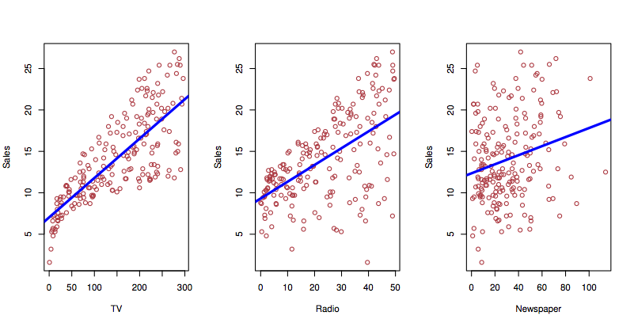

# Linear Regression {#linear-regression}


```{r include=FALSE}
require(mosaic)
require(dplyr)
```

## Day 4 Preview

* The linear model (e.g. what `lm()` does)
* A variety of questions relevant to different purposes, e.g.
    - how good will a prediction be?
    - what's the strength of an effect?
    - is there synergy between different factors?


### ISL book's statement on why to study linear regression

> "Though it may seem somewhat dull compared to some of the more modern statistical learning approaches described ... later ..., linear regression is still a useful and widely used statistical learning method.  Moreover, it serves as a good jumping-off point for newer approaches....  Consequently, the importance of having a good understanding of linear regression before studying more complex learning methods cannot be overstated."

Concepts from linear regression:

* Compact representation of model form: polynomial coefficients.
* Much of inference (confidence intervals, hypothesis tests) can be expressed in terms of a polynomial coefficient.
* "Size" of model quantifiable as an integer: number of coefficients: degrees of freedom.
* Highly efficient estimation (when doing least squares)


## Small data

The regression techniques were developed in an era of small data, such as that that might be written in a lab notebook or field journal.  As a result:

1. Emphasis on very simple descriptions, such as means, differences between means, simple regression.
2. Theoretical concern with details of distributions, such as the t-distribution. 
    - the difference between z- and t-distributions are of no consequence for moderate DF and higher.
3. No division into training and testing data.  Data are too valuable to test! (Ironic, given the importance of replicability in the theory of the scientific method.)

As a consequence of (3), there's a great deal of concern about *assumptions*, e.g. 

* linearity of $f({\mathbf X})$
* structure of $\epsilon$: IID --- Independent and Identically Distributed
    - uncorrelated between cases
    - each is a draw from the same distribution.


## Programming basics: Linear Models

Syntactic element: **formulas**. Formulas provide a way of using variables "symbolically." This is useful, for instance, in depicting the desired relationship among variables. Two forms:

- `y ~ x` two-sided
- `~ x` one-sided
- NOT ALLOWED, `y ~`

Important functions: 

- `lm()`, `predict()` , `anova()`, `summary()`.
- For later: `solve()`, `model.matrix()`.
- From 155: `coef()`, `fitted()`, `resid()`

Training with `lm()`: Specify formula `Y ~ X1 + X2` ...

```{r}
data(College, package = "ISLR")
mod <- lm(Outstate ~ Enroll + Accept + perc.alumni, data = College ) 
coef(mod)
```

What kind of thing is `mod`?

Model output with `predict()`
```{r}
predict(mod, 
        newdata = data.frame(Enroll = 100, Accept = 1000, perc.alumni = 25))
```

What kind of thing is the output of `predict()`?

```{r}
predict(mod, interval = "confidence",
        newdata = data.frame(Enroll = 100, Accept = 1000, perc.alumni = 25))
predict(mod, interval = "prediction",
        newdata = data.frame(Enroll = 100, Accept = 1000, perc.alumni = 25))
```

Why is the "confidence interval" so much narrower than the "prediction interval?"

**Inference** with `anova()` and `summary()`. This is all "in-sample" inference, not cross-validated.

```{r}
M <- model.matrix(~ Enroll + Accept * perc.alumni, data = College)
qr.solve(M, College$Outstate)
```

For the people who have had linear algebra, why doesn't this work?
```{r error = TRUE}
solve(M, College$Outstate)
```


[Indexing on data: training and testing data sets](../ProgrammingActivities/Day-03-Programming.html)


## Review of Day 4, Sept 15, 2016

* Discussed the linear regression architecture and how it relates to machine learning.
    - linear regression is designed to work even in "small data" situations where
        a. cross-validation is not appropriate
        b. the number of model degrees of freedom may be almost as large as $n$
    - provides a ready definition of the "size" of a model: the number of coefficients.
* Introduced the main software used in linear regression, `lm()` and `predict()`
* Programming basics: indexing of vectors, matrices and data frames.

## Regression and Interpretability

Regression models are generally constructed for the sake of interpretability:

* Global linearity
* Coefficients are indication of effect size. The coefficients have physical units.
* Term by term indication of statistical significance

An example on `College` data from `ISLR` package 

```{r}
data(College, package="ISLR")
College$Yield <- with(College, Enroll/Accept)
mod1 <- lm(Yield ~ Outstate + Grad.Rate + Top25perc, data = College)
mosaic::rsquared(mod1)
mod2 <- lm(Yield ~ . - Grad.Rate, data = College)
mosaic::rsquared(mod2)
```
* What variables matter?
* How good are the predictions?
* How strong are the effects?

## Toward an automated regression process

In machine learning, we ask the computer to identify patterns in the data. 

* In "traditional" regression (which is still very important), we specify the explanatory terms and the computer finds the "best" model with those terms: least squares. 
* In machine learning, we want the computer to figure out which terms, of all the possibilities, will lead to the "best" model.


## Selecting model terms

The regression techniques 

- Traditional regression: 
    - Our knowledge of the system being studied.
    - Heirarchical principal
        * main effects, then
        * interaction.
- Machine learning
    - Look at all combinations of variables? 
    - Activity 1: 
        * Write a statement that will pull 2 random variables from a data frame *and* the explanatory variable.
        * Use `Yield ~ .` as the formula.
```{r}
explanatory_vars <- names(College)[-19]

my_vars <- sample(explanatory_vars, size = 12)
new_data <- College[ , c(my_vars, "Yield")]
mod <- lm(Yield ~ ., data = new_data)
mosaic::rsquared(mod)
mod
2^18
```
        
- Activity 2: 
        * How many combinations are there of $k$ explanatory variables? Calculate this for $k = 5, 10, 15, 20$. How many are there in the `College`?
        * What about with interactions?
- How long does it take to fit a model?
```{r}
system.time( do(1000) * lm(Yield ~ ., data=College))
256*7/3600
```

```{r}
names(College)
```
    
With $k$ explanatory variables, $2^k$ possibilities, not even including interactions. Including first-order interactions, it's
    $2^k + 2^{k(k-1)/2}$. Calculate this for $k=3.
    - Increase in $R^2$? Problem: $R^2$ will always go up as we add a new term.
    - Some other measure that takes into account how much $R^2$ should go up.


## Programming basics: Graphics

```{r}
plot(1, type = "n", xlim = c(100,200), ylim = c(300,500))
```

Basic functions:

1. Create a frame: `plot()`.  Blank frame: `plot( , type="n")`
    - set axis limits, 
2. Dots: `points(x, y)`, `pch=20`
3. Lines: `lines(x, y)` --- with `NA` for line breaks
4. Polygons: `polygon(x, y)` --- like lines but connects first to last.
    - fill
5. Color, size, ... `rgb(r, g, b, alpha)`, "tomato"


## In-class programming activity 

[Programming Activity 4](../Daily-Programming/Day-4-Programming-Task.pdf): Drawing a histogram.

## Day 5 Summary

### Linear regression

* Discussed "interpretability" of linear models, e.g. meaning of coefficients, confidence intervals, R^2, etc.
    - which variables are "important" via ANOVA and mean sum of squares
* Discussed metrics to compare models 
    - R^2 -- not fair, since "bigger" models are always better
    - Punishment: Two criteria for judging
        - R^2
        - How big the model is.
        - These two are somehow combined together into "adjusted R^2." We'll say more about that today.
    - Cross-validation. Judge each model on its "out of sample" prediction performance.

### Coefficients as quantities

Coefficients in linear models are not just numbers, they are physical quantities with dimensions and units.

* Dimensions are always (dim of response)/(dim of this term)
* The model doesn't depend on the units of these quantities.  The units only set the magnitude to the numerical part of the coefficient, but as a quantity a coefficient is the same thing regardless of units.
* Conversion from one unit to another by multiplying by 1, but expressed in different units, e.g. 60 seconds per minute, 2.2 pounds per kilogram.


### Graphics basics

1. API for graphics: `plot()`, `points()`, `lines()`, `polygon()`, `text()`, ...


## K-nearest neighbors

K-nearest neighbors is a simple, general kind of function-building method.  But some problems:

* Interpretability: but you can always take partial derivatives.
* When you have prediction (aka "explanatory") variables in dollars and in miles, how do you calculate the distance between points?  What are the dimensions of distance?
    - Dimensionality refers to the physical feature, e.g. time, distance, area, volume, money, charge, luminance, mass, ...
    - Units are the ways in which dimensions are measured, e.g., cups, gallons, liters ... all refer to volume
        * Give some examples of units for each of the dimensions.
        * Some everyday quantities are dimensionless, e.g. pure numbers.  Give some examples: ... (angles, percent, fractions, ... but not ratios in general.)
    - Regression fixes units automatically, since the coefficients themselves have dimensionality. They will adjust automatically to changes in units, so the model is the same regardless of whether we use miles, km, parsecs, ... 
    - In KNN, to avoid dependence on units, need to do some standardization by dividing by something in the same units, e.g. sd.
* Curse of dimensionality.
    Let's create 1000 randomly placed points in the unit square:
```{r}
rpts <- matrix(runif(2*1000), ncol=2)
```

What's the distribution of distances from a single random point to the 1000 others:
```{r}
our_point <- runif(2)
```

The distance between our point and each of the others
```{r}
tmp <- matrix(our_point, ncol=2, nrow=1000, byrow=TRUE)
delta <- sqrt(rowSums((rpts - tmp)^2))
```

* How far away is a typical point?
* Write a function that takes the matrix of points and the "our point" and finds the distance from our point to each and every one of the points in the matrix.
* How far away is a typical point in 1-dimensional space?
* In 10-dimensional space?
* In 100-dimensional space?


## In-class programming activity 

[Day 5 activity](../Daily-Programming/Day-05-Programming-Task.pdf)

Drawing a histogram.

## Day 6 Summary

* $R^2$ 
    - var(fitted) / var(response)
    - partitioning of variance: 
        - var(fitted) + var(resid) = var(response)
        - same with sum of squares: SS(fitted) + SS(resid) = SS(response)
* Adjusted $R^2$
    - $R^2$ vs $p$ picture
    - Derive a formula from the picture: we've got $p+1$ df to get from $R^2 = 0$ to our observed $R^2$, so $n - (p+1)$ df left for the residuals. Rate of increase due to junk is $(1 - R^2) / (n - p - 1)$. Projecting back $p$ terms gives an adjustment of $(1 - R^2) / \frac{p}{n - p - 1}$. Subtract this from $R^2$.
    - Wikipedia gives two formulas:
        - $Adj R^2 = {1-(1-R^{2}){n-1 \over n-p-1}}$ -- this projects back $n-1$ terms from 1.
        - $Adj R^2 = {R^{2}-(1-R^{2}){p \over n-p-1}}$ --- projects back $p$ terms from $R^2$.
        
- Adjusted $R^2$
- Whole model ANOVA.
- ANOVA on model parts


## Measuring Accuracy of the Model

* $R^2$ = Var(fitted)/Var(response)
* Adjusted $R^2$ - takes into account estimate of average increase in $R^2$ per junk degree of freedom
* Residual Standard Error - Sqrt of average square error per residual degree of freedom. The sqrt of the mean square for residuals in ANOVA.

## Bias of the model

You need to know the "truth" to calculate the bias. We don't.

```{r echo = FALSE}

```

* Perhaps effect of TV goes as sqrt(money) as media get saturated?
* Perhaps there is a synergy that wasn't included in the model?

### Theory of whole-model ANOVA.

Standard measure: 
$\frac{\mbox{Explained amount}}{\mbox{Unexplained amount}}$

Examples:

- Standard error of mean:  $\frac{\hat{\mu}}{\sigma / n}$ -- note the $n$.
- t statistic on difference between two means: $\frac{\hat{\mu}_1 - \hat{\mu}_2}{\sigma / (n-1)}$
- F statistic: $\frac{SS / df1}{SSR / df2}$
    - df1 is the number of degrees of freedom involved by the model or model term under consideration.
    - df2 is $n - (p - 1)$ where $p$ is the total degrees of freedom in the model.  (I called this $m$ in the Math 155 book.)  The intercept is what the $-1$ is about: the intercept *can never* account for case-to-case variation.

Trade-off between eating variance and consuming degrees of freedom.


## Forward, backward and mixed selection

Use the `College` model to demonstrate each of the approaches by hand.  Start with `pairs()` or write an `lapply()` for the correlation with `Yield`?

Create a whole bunch of model terms

- "main" effects
- "interaction" effects
- nonlinear transformations: powers, logs, sqrt, steps, ...
- categorical variables

Result: a set of $k$ vectors that we're interested to use in our model.

Considerations:

- not all of the $k$ vectors may pull their weight
- two or more vectors may overlap in how they eat up variance

Algorithmic approaches:

- Try all combinations, pick the best one.
    - computationally expensive/impossible $2^k$ possibilities
    - what's the sensitivity of the process to the choice of training data?
- "Greedy" approaches

## Basics of linear algebra

* A vector --- a column of numbers. The *dimension* is the count of numbers in the vector.
* A *space*: the set of all possible vectors of a given dimension.
* A *matrix* --- a colection of vectors (all the same dimension).
* *Dot product*: a basic calculations on vectors:
    - the length (via Pythagorus)
    - the angle between two vectors
    - orthogonality: when two vectors are perpendicular, their dot product is zero.
* Matrix operation: *Linear combination*.
    - Take a linear combination of the vectors in a matrix. Analogous to taking a trip. Result: a vector representing the end-point of the trip.
* The *subspace* spanned by the matrix: the set of all possible points you can get to with a linear combination.
* Matrix operation: *Orthogonalization* --- Find perpendicular vectors that span the same subspace as a matrix.
* Matrix operation: *Projection*
    - Given a matrix M and a vector V, find the closest point in the subspace of M to the vector V.
* Matrix operation: *inversion* --- the inverse operation to linear combination.
    - given an end-point in the space spanned by M, figure out a linear combination that will get you there.
    
    

## The geometry of fitting

* Data tables: cases and variables. 
* Case space (the rows of the matrix) and variable space (the columns).
* A quantitative variable is a vector.
* A categorical variable can be encoded as a set of "dummy" vectors.
* Response variable and explanatory variable
* The linear projection problem: find the point spanned by the explanatory variables that's closest to the response.  That linear combination is the best-fitting model.
    * One explanatory and the response
    * Two explanatory on board and the response on the board (perfect, but meaningless fit)
    * Two explanatory in three-space and the response (residual likely)


## Precision of the coefficients

$$ \mbox{standard error of B coef.} = 
| \mbox{residuals} | \frac{1}{| \mbox{B} |}\ 
\frac{1}{\sin( \theta )}\ \frac{1}{\sqrt{n}}\ \sqrt{\frac{n}{n-m}}$$

* $m$ --- degrees of freedom in model
* $\theta$ --- angle between this model vector and the space spanned by the others
* B --- this model vector 
* residuals --- the residual vector


## Programming Basics: Functions

1. Syntax of functions:
```r
name <- function(arg1, arg2, ...) {
  body of function. Can use arg1, arg2, etc. 
}
```

* typically you will return a value. The value calculated by the last command line in the body is what's returned. Or you can use `return()` at any point in the function.
* Often functions are designed to produce "side effects", e.g. graphics.  
* Scope: what happens in functions stays in functions.

1. Create a plotting frame: `plot()`
    - Write a function that makes this more convenient to use. What features would you like. 
    ```{r}
    blank_frame <- function(xlim, ylim) {
      
    }
    ```
2. Write a function to draw a circle.
    - What do you want the interface to look like? What arguments are essential? What options are nice to have?
    


## In-class programming activity

Histogram and density functions 

[Day 6 activity](../Daily-Programming/Day-06-Programming-Task.pdf)

