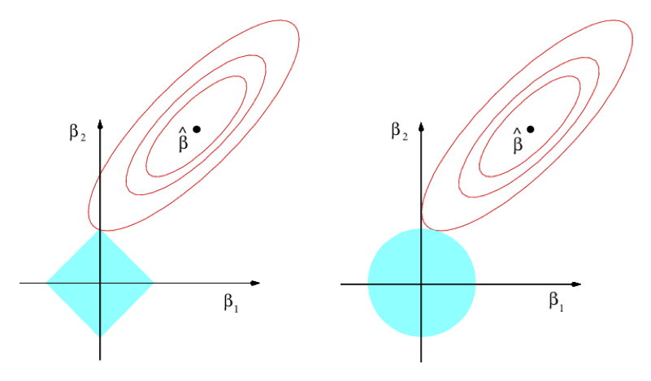

# Regularization, shrinkage and dimension reduction

```{r include = FALSE}
data(CPS85, package = "mosaicData")
library(glmnet)
library(ISLR)
```

## Best subset selection

Algorithm 6.1 from ISLR

1. Let $M_0$ denote the null model, which contains no predictors. This model simply predicts the sample mean for each observation.
2. For k in 1,2,...p:
    a. Fit all p models that contain exactly k predictors. $\left(\begin{array}{c}k\\p\end{array}\right)$
    b.  Pick the best among these k models, and call it $M_k$. Here best is defined as having the smallest RSS, or equivalently largest R$^2$.
3. Select a single best model from among $M_0, \ldots , M_p$ using cross- validated prediction error, C$_p$, AIC, BIC, or adjusted $R^2$.

```{r echo = FALSE, fig.cap='ISLR Figure 6.1.  The models from best subset selection'}
knitr::include_graphics("Images/Chapter-6/6.1.png")
```

## Approximation to best subset selection

For large $p$, there are too many possible models to fit all of them: $2^p$. So, some heuristics.

1. There are only $p$ models with just one term: $d = 1$. So easy to try all of them.
2. There are only $p(p-1)/2$ models with just two terms $d = 2$. Again, easy to try all of them.
3. Starting out from $M_1$ or $M_2$, keep all of those terms and look for the best individual term to add. There will be only $p-(d-1)$ of them. We presume that one of these will be near the frontier of the best possible model with $d$ terms.
4. Repeat the process $k \gg p$ times, moving forward and back randomly, adding a term or deleting a term. 
5. This will take roughly $k p$ fits $\alpha p^2$ fits, where $\alpha$ is a constant $k/p$, say 10.
6. Compare this to $2^p$. Setting $\alpha = 10$, find the ratio $\frac{2^p}{\alpha p^2}$ for $p = 5, \ldots, 40$.

```{r}
p <- 1:40
(2^p) / (10 * p^2)
```

Exhaustion seems find up through about $d = 20$ --- only 100 times more expensive than the random search.


## Classical theory of best model choice

We *punish* models with lots of terms.

In-sample  |  Adjusted   | Out-of-sample
-----------|-------------|---------------
$\frac{1}{n}$RSS | $C_p = \frac{1}{n}(\mbox{RSS} + 2 d \hat{\sigma}^2)$       | cross-validated prediction error
. | $\mbox{AIC} = -2 \ln {\cal L} - 2 d$ | .
. | $\mbox{AIC}_{ls} = \frac{1}{\hat{\sigma}^2}C_p$ | .
. | $\mbox{BIC} = \frac{1}{n} (\mbox{RSS} + \ln(n) d \hat{\sigma}^2)$ | .
R$^2$ | Adjusted R$^2$ | ???

$\mbox{Adjusted R}^2 = 1 - \frac{\mbox{RSS}/(n-d-1)}{\mbox{TSS}{(n-1)}}$


```{r echo = FALSE, fig.cap='ISLR Figure 6.2.  Note that the values on the vertical axis are the best for that "number of predictors.'}
knitr::include_graphics("Images/Chapter-6/6.2.png")
```


**Uncertainty**

Repeat the analysis for different test sets or using different folds in k-fold cross validation.

* At each value of "Number of Predictors", there will be a distribution.
* *One-standard-error rule*: select the smallest model for which the estimated test error is within one standard error of the lowest point on the curve.

## Optimization

### What are we optimizing over?

Choose the best set of columns from the model matrix.

```{r}
Small <- mosaic::sample(mosaicData::KidsFeet, size = 5)
row.names(Small) <- NULL
M1 <- model.matrix(width ~ length + sex, data = Small)
M2 <- model.matrix(width ~ length + sex*biggerfoot, data = Small)
M3 <- model.matrix(width ~ length*domhand*sex + sex*biggerfoot, data = Small)
```

## Shrinkage methods

Example, a roughly quadratic cloud of points.  Better to fit it with a constant, straight line, a quadratic? 

* Depends on the amount of data.
* What if you have only n=3 or 4?

Constant will have the least sampling variation but the most bias.

Quadratic will have the least bias but the most sampling variation.

**Shrinkage idea**: Make a linear combination of the constant model with the "full" model.

### Ridge regression

The objective function: minimize

$$\sum_{i=1}^n \left(y_i - \beta_0 - \sum_{j = 1}^p \beta_j x_{ij}\right)^2 + \lambda \sum_{j=1}^p \beta_j^2$$


```{r echo = FALSE, fig.cap = "ISLR Figure 6.4."}
knitr::include_graphics("Images/Chapter-6/6.4.png")
```

Note the y-axis label: "Standardized Coefficients." 

* Remember that coefficients have units that depend on the response variable and the explanatory variable(s) participating in the coefficient. 
* Those coefficients will typically be different from model term to model term.
* Meaningless to add up numbers with different physical dimension.

... So, standardize the explanatory variables.

Another perspective on the reason to standardize: Some of the coefficients might be huge numerically, others small. In such a situation, the huge coefficients will dominate; the small ones will have little influence on the shrinkage.

```{r}
data(CPS85, package = "mosaicData")
lmod <- lm(wage ~ age + educ + sex + exper + union + married, data = CPS85)
x <- model.matrix(wage ~ age + educ + sex + exper + union + married, data = CPS85)
foo <- glmnet(x, CPS85$wage, alpha = 0, lambda = 1)
foo$lambda.min
predict(foo,s=0.1,exact=TRUE,type="coefficients")
coef(foo, exact = FALSE)
```
For `Credit` dataset: <http://www-bcf.usc.edu/~gareth/ISL/Credit.csv>


### Carseats

```{r}
lmod <- lm(Sales ~ ., data = Carseats)
x <- model.matrix(Sales ~ ., data = Carseats)
foo <- glmnet(x, Carseats$Sales, alpha = 1, lambda = 0.1)
foo$lambda.min
predict(foo,s=0.1,exact=TRUE,type="coefficients")
preds <- predict(foo, newx = x, type = "response")
mean((fitted(lmod)- Carseats$Sales)^2)
mean((preds - Carseats$Sales)^2)
coef(foo, exact = FALSE)
```

Questions:

- Why is the mean square error worse for the ridge than for OLS?


## LASSO

The objective function: minimize

$$\sum_{i=1}^n \left(y_i - \beta_0 - \sum_{j = 1}^p \beta_j x_{ij}\right)^2 + \lambda \sum_{j=1}^p |\beta_i|$$
Almost exactly the same as ridge regression. But the small change makes a big difference.

```{r echo = FALSE, fig.cap = "ISLR Figure 6.7.", out.width = "100%"}

```

```{r}
lmod <- lm(wage ~ age * educ * sex * union * married, data = CPS85)
x <- model.matrix(wage ~ age * educ * sex * union * married, data = CPS85)
foo <- glmnet(x, CPS85$wage, alpha = 1, lambda = 0.16)
foo$lambda.min
predict(foo,s=foo$lambda.min,exact=TRUE,type="coefficients")
preds <- predict(foo, s = 0.16, newx = x, type = "response")
mean((preds - CPS85$wage)^2)
mean((fitted(lmod)- CPS85$wage)^2)
```

## Review

We started by considering one mathematical representation of the problem: Choose $\beta_1, \beta_2, \ldots, \beta_p$ to minimize this *objective function*

$$\sum_{i=1}^n \left(y_i - \beta_0 - \sum_{j = 1}^p \beta_j x_{ij}\right)^2 + \lambda \sum_{j=1}^p \beta_j^2$$
The result depends on the value of $\lambda$, which is often called the *Lagrange multiplier*.

The motivation for this form of the objective function is rooted in two different and conflicting goals:

1. Get the model as close as possible to the data: minimize the sum of square errors.
2. Keep the $\beta$'s small: minimize the model variance.

*Reductio ad absurdum* argument. Suppose $\lambda \rightarrow \infty$. Then the best $\beta$'s would be zeros. Such a model has zero model variance, since we'll get exactly the same result on every data set used to train the model.

Another way to think about multi-objective optimization ...

We have several goals as a function of the adjustable parameters. Let's denote them by $g_1(x), g_2(x), g_3(x), \ldots$. For instance, suppose $g_1(x)$ is the appeal of a meal as a function of the ingredients, $g_2(x)$ is the vitamin content, $g_3(x)$ is the protein content, $g_4(x)$ is the amount of salt, and so on.

We want to find the parameters $x$ that minimize some mixture of the objectives, e.g. 

$$T(x; \lambda_1, \lambda_2, \ldots) \equiv \lambda_1 g_1(x) + \lambda_2 g_2(x) + \ldots$$
We don't know what the $\lambda$'s are; they reflect the relative importance of the different components of the objective function. We could, of course, make them up. But instead ...

1. Let's choose one of the components to be our sole objective. It can be any of the components, the end result will be the same regardless. The others we will consider as *constraints*. For instance, we might take *taste* ($g_1(x)$) as our objective but impose constraints: calories should be between 800 and 1200, salt should be below 1200 mg, protein should be above 50 grams.
2. Consider all the values of $x$ that satisfy the constraints. Search over these to find the one that maximizes our selected objective component. This is called *constrained optimization*.
3. Consider each of the constraints. Find out how much the selected objective will improve if we relax that constraint a bit, say allowing salt to be 1300 mg. The ratio is the Lagrange multiplier $\lambda_i$.

$$\frac{\mbox{change in taste}}{\mbox{change in constraint}_i} \equiv \lambda_i$$ 

Now ask questions about priorities: If I were to ease up on the constraint, would I get enough change in the objective to be worthwhile? Or, if I were to tighten the constraint, would the resulting change in objective be acceptable? Change the constraints accordingly until you no longer see a net gain by changing the constraints.

Let's translate this to ridge and lasso regression.

1. The selected component of the overall objective: Minimize the in-sample sum of square error. 
2. The constraint: how big are we willing to make the coefficients? (Remember, by standardizing the variables we make it possible to calculate a total size.)
3. Evaluating the trade-offs between constraints and objectives: does the out-of-sample prediction error get smaller. 

The picture:

- the red shows the objective function
- the blue shows the permitted region for the coefficients to satisfy the constraint.

```{r echo = FALSE, fig.cap = "ISLR Figure 6.7."}

```

We can imagine increasing or decreasing the constraints, and will get a different optimum at each level of the constraint.

Why the circle and diamond?

Three different "metrics," that is three different ways of combining parts to get an overall size.

- $L^2$ --- square-root of the sum of squares. The usual Euclidean distance. Circle
- $L^1$ --- sum of the absolute values. Sometimes called the Manhattan metric. Diamond
- $L^\infty$ --- the biggest individual value. Square.

Predicting `Salary` in the `ISLR::Hitters` data:


```{r eval=FALSE}
Without_NA <- na.omit(ISLR::Hitters)
inds <- sample(nrow(Without_NA), size = nrow(Without_NA)/2)
Train <- Without_NA[inds,]
Test <- Without_NA[-inds,]
y_all <- Without_NA$Salary
x_all <- model.matrix(Salary ~ ., data=Without_NA)
y_train <- Train$Salary
x_train <- model.matrix(Salary ~ ., data=Train)
y_test <- Test$Salary
x_test <- model.matrix(Salary ~ ., data=Test)
ridge_mod <- cv.glmnet(x_train, y_train, alpha = 0)
ridge_mod$lambda.min
ridge_pred <- predict(ridge_mod, s=0, newx = x_test, exact=TRUE)
mean((ridge_pred - y_test)^2)
final <- glmnet(x_all, y_all, alpha=0)
predict(final, type="coefficients", s=ridge_mod$lambda.min)

```


Lasso: Do we really need all of those variables?

```{r eval=FALSE}
lasso_mod <- cv.glmnet(x_train, y_train, alpha = 1)
lasso_mod$lambda.min
lasso_pred <- predict(lasso_mod, s=0, newx = x_test, exact=TRUE)
mean((lasso_pred - y_test)^2)
final <- glmnet(x_all, y_all, alpha=1)
predict(final, type="coefficients", s=lasso_mod$lambda.min)
```

```{r echo = FALSE, fig.cap = "ISLR Figure 6.4"}
knitr::include_graphics("Images/Chapter-6/6.4.png")
```

```{r echo = FALSE, fig.cap = "ISLR Figure 6.7"}

```


## Multi-collinearity


The SAT story.
```{r}
summary(lm(sat ~ expend, data=mosaicData::SAT))$coef
summary(lm(sat ~ expend + ratio, data=mosaicData::SAT))$coef
summary(lm(sat ~ expend + ratio + salary, data=mosaicData::SAT))$coef
mosaic::rsquared(lm(expend ~ ratio + salary, data=mosaicData::SAT))
```

```{r echo = FALSE, fig.cap = "Confidence interval explanation"}
knitr::include_graphics("Images/CI-1.png")
```

```{r echo = FALSE, fig.cap = "Confidence interval explanation, part 2"}
knitr::include_graphics("Images/CI-2.png")
```


```{r}
load("Images/mona.rda")
rankMatrix(mona)
# pick a vector at random; column 151 versus the first 131 columns
mosaic::rsquared(lm(t(mona)[,151] ~ t(mona)[,-151]))
```


Variance inflation factor

$\mbox{VIF}(\beta_j) = \frac{1}{1 - R^2_{x_j|x_{-j}}}$

Getting rid of vectors that correlate substantially with one another can reduce the variance inflation factor.


## Creating correlations

Generate points on circles of radius 1, 2, 3, ...

```{r}
make_circles <- function(radii = 1:2, nangs = 30) {
  theta = seq(0, 2*pi, length = nangs)
  x <- rep(cos(theta), length(radii))
  y <- rep(sin(theta), length(radii))
  r <- rep(radii, each = nangs)
  col <- rep(rainbow(nangs), length(radii))
  data.frame(x = x * r, y = y * r, r = r, col = col)
}
transform_circles <- function(M, circles = NULL) {
  if (is.null(circles)) circles <- make_circles()
  XY <- rbind(circles$x, circles$y)
  new <- M %*% XY
  circles$x = new[1, ]
  circles$y = new[2, ]
  
  circles
}


Trans <- matrix(c(1, 2, -3, -1), nrow = 2, byrow = TRUE)
After_trans <- transform_circles(Trans)
plot(y ~ x, data = After_trans, col = (After_trans$col), asp = 1, pch = 20)

svals <- svd(Trans)
Start <- make_circles()
plot(y ~ x, data = Start, col = Start$col, asp = 1, pch = 20)
After_V <- transform_circles(t(svals$v), Start)
plot(y ~ x, data = After_V, col = After_V$col, asp = 1, pch = 20)
After_V_lambda <- transform_circles(diag(svals$d), After_V)
plot(y ~ x, data <- After_V_lambda, col = After_V_lambda$col, asp = 1, pch = 20)
After_V_lambda_U <- transform_circles(svals$u, After_V_lambda)
plot(y ~ x, data = After_V, col = After_V_lambda_U$col, asp = 1, pch = 20)
```

## Rank 1 Matrices

Suppose all the columns in a matrix are simple multiples of the first column. All of the columns would be exactly collinear, so `lm()` will produce `NA` for all but one of the coefficients (putting the intercept aside). Lasso would zero out all but one of the coefficients, ridge would ...

```{r}
set.seed(101)
one <- outer(rnorm(100), rnorm(10))
two <- outer(rnorm(100), rnorm(10))
three <- outer(rnorm(100), rnorm(10))
y <- rnorm(100) + 7 * one[, 1] - 2 * two[, 1]
x <- one + two

dim(one)
lm(y ~ x)
lasso_mod <- cv.glmnet(x, y, alpha = 1)
lasso_mod$lambda.min
predict(lasso_mod, type="coefficients", s=lasso_mod$lambda.min)
ridge_mod <- cv.glmnet(one, y, alpha = 0)
ridge_mod$lambda.min
predict(ridge_mod, type="coefficients", s=ridge_mod$lambda.min)
```


## Idea of singular values.

Find orthogonal vectors to describe the ellipsoidal cloud.  The singular value describes "how long" each ellipsoidal axis is.

Correlation $R^2_{x_j | x_{-j}}$ gets increased for each *direction* that overlaps between $x_j$ and $x_{-j}$ --- it doesn't matter how big the singular value is in that direction.  Only by throwing out *directions* can we reduce $R^2_{x_j | x_{-j}}$

Nice illustration:


[Source](https://en.wikipedia.org/wiki/Singular_value_decomposition#/media/File:Singular-Value-Decomposition.svg)

## Dimension reduction

Re-arrange the variables to squeeze the juice out of them.

1. Matrix
2. Approximate matrix in a least squares sense.  If that approximation includes the same column or more, we can discard the repeats.
2. Outer product 
3. Rank-1 matrix constructed by creating multiples of one column.
4. Create another vector and another rank-1 matrix.  Add it up and we get closer to the target.

Creating those singular vectors:

* singular value decomposition
* ${\mathbf D}$ gives information on how big they are
* orthogonal to one another
* cumulative sum of ${\mathbf D}$ components gives the amount of variance in the approximation.
```{r}
load("images/mona.rda")
res <- svd(mona)
approx <- 0
for (i in 100) {
  approx <- approx + outer(res$u[,i], res$v[,i]) * res$d[i]
}
image(approx, asp=1)
```


Picture in terms of gaussian cloud.  The covariance matrix tells all that you need.

Using `pcr()` to fit models, interpreting the output.

```{r}
library(pls)
pcr.fit <- pcr(Salary ~ ., data = ISLR::Hitters, scale=TRUE, validation="CV")
summary(pcr.fit)
validationplot(pcr.fit, val.type = "MSEP")
```
