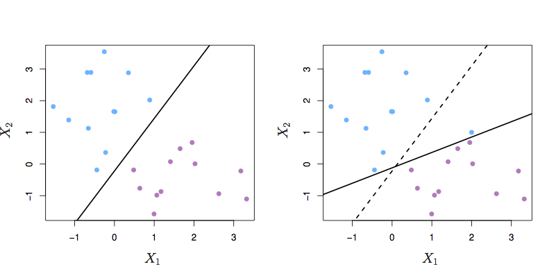
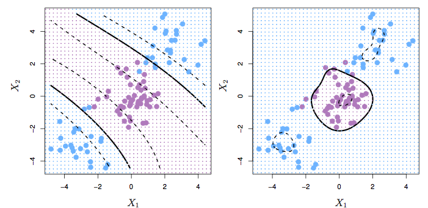

```{r include=FALSE}
require(mosaic)
require(ISLR)
require(glmnet)
require(pls)
require(gam)
knitr::opts_chunk$set(tidy=FALSE)
```

# Support Vector Classifiers

The methods we have studied so far use *all* the data to fit the model.  But for classification, it may be that only the cases that are intermixed are telling for distinguishing one group from the other.  The bulk of cases, clustered happily in their home country, may not be so useful.


## Lines, planes, and hyperplanes

* $y = m x + b = \beta_0 + \beta_1 x$
* $z = a + b x + c y = \beta_0 + \beta_1 x + \beta_2 y = \beta_0 + \beta_1 x_1 + \beta_2 x_2$
    - $\beta_1$ and $\beta_2$ give the partial derivatives w.r.t. $x_1$ and $x_2$.
    - But what if the plane is intended to be parallel to the z-axis? Partials are infinite.
    - We would write the formula with $x_1$ or $x_2$ on the left-hand side.
    - $0 = \beta_0 + \beta_1 x_1 + \beta_2 x_2 + \beta_3 x_3$
    - $\beta_0$ sets the distance of the plane from the origin.
    - $\beta_1, \beta_2, ...$ set the orientation of the plane.

Another perspective. $d$ points in $d$-dimensional space define a hyperplane.  The hyperplane is a linear combination of the $d-1$ vectors $x_2 - x_1$, $x_3 - x_1$, $x_4 - x_1$, ...

The unique normal to the place is the vector not in the $d-1$ dimensional subspace.


### Rescaling X

It's the relative size of the $\beta_j$ that's important.  So let's agree to scale them so that $\sum_{j=1}^p \beta_j^2 = 1$.


### Impose an absolute constraint

Formalism:

* $y_i = 1$ means class A
* $y_i = -1$ means class B

Constraints:

$y_i ( \beta_0 + \beta_1 x_{i1} + \beta_2 x_{i2} + \cdots + \beta_p x_{ip}) > 0$


Says, "You must be on the right side of the boundary."

* Alternative:

$y_i ( \beta_0 + \beta_1 x_{i1} + \beta_2 x_{i2} + \cdots + \beta_p x_{ip}) > M > 0$


Says, "You must be on the right side of the boundary and at least $M$ units away from the boundary." Like, "You must produce $M$ units less than your permits allow, or less."

```{r echo = FALSE, fig.cap='ISLR Figure 9.2 from ISLR'}
knitr::include_graphics("Images/Chapter-9/9.2.png")
```

There may be no *feasible solution*, or there may be many.  This formulation provides no way to deal with the no-solution situation, and no way to choose the best of the many solutions.

```{r echo = FALSE, fig.cap='ISLR Figure 9.3 from ISLR'}
knitr::include_graphics("Images/Chapter-9/9.3.png")
```

## Optimizing within the constraint

* maximize over $\beta_0$, $\beta_1$, ... the quantity $M$
* constraints that $y_i ( \beta_0 + \beta_1 x_{i1} + \beta_2 x_{i2} + \cdots + \beta_p x_{ip}) > M$
* and remember that $\sum_{j=1}^{p} \beta_j^2 = 1$.

Says, "You must be on the right side of the boundary and as far from it as possible." $M$ measures how far from boundary.

```{r echo = FALSE, fig.cap='ISLR Figure 9.5 from ISLR'}

```

## Allowing violations of the boundary

* maximize over $\beta_0$, $\beta_1$, ... the quantity $M$
* constraints that $y_i ( \beta_0 + \beta_1 x_{i1} + \beta_2 x_{i2} + \cdots + \beta_p x_{ip}) > M (1 - \epsilon_i)$
* $\epsilon_i \geq 0$ --- Once you're on the good side of the margin, you don't get any credit that could be used to increase $M$!
* $\sum_{i=1}^n \epsilon_i < C$ --- but let's keep the epsilons small.  We're willing to trade off between epsilons.  
    - $C$ is the budget for violations, a *tuning parameter*.
    - For a given $C$, there's no guarantee that we can meet the constraints. (That is, no guarantee that there's a *feasible solution*.)
    - But there will be some $C$ for which there is a feasible solution.

* and remember that $\sum_{j=1}^{p} \beta_j^2 = 1$.

```{r echo = FALSE, fig.cap='ISLR Figure 9.6 from ISLR'}
knitr::include_graphics("Images/Chapter-9/9.6.png")
```

FIGURE 9.6. Left: A support vector classifier was fit to a small data set. The hyperplane is shown as a solid line and the margins are shown as dashed lines. Purple observations: Observations 3,4,5, and 6 are on the correct side of the margin, observation 2 is on the margin, and observation 1 is on the wrong side of the margin. Blue observations: Observations 7 and 10 are on the correct side of the margin, observation 9 is on the margin, and observation 8 is on the wrong side of the margin. No observations are on the wrong side of the hyperplane. Right: Same as left panel with two additional points, 11 and 12. These two observations are on the wrong side of the hyperplane and the wrong side of the margin.

```{r echo = FALSE, fig.cap='ISLR Figure 9.7 from ISLR'}
knitr::include_graphics("Images/Chapter-9/9.7.png")
```

Figure 9.7 from ISL. A support vector classifier was fit using four different values of the tuning parameter $C$ in (9.12)–(9.15). The largest value of $C$ was used in the top left panel, and smaller values were used in the top right, bottom left, and bottom right panels. When $C$ is large, then there is a high tolerance for observations being on the wrong side of the margin, and so the margin will be large. As $C$ decreases, the tolerance for observations being on the wrong side of the margin decreases, and the margin narrows.

## Nonlinear Boundaries

The *support vector "classifier"* builds a boundary based on a linear combination of linear function.  One can add in nonlinear transformations of the predictors as well as interactions.  This increases the dimension of the predictor space.  The resulting boundary will still be linear in the values of the predictors, but when considered in the original predictor space, can be nonlinear.

Example: A linear function of $x$, $y$, $x^2$, $y^2$, and $xy$

```{r}
require(mosaic)
f <- function(x,y){3*x - 2*y + x^2 + 2*y^2 - x*y}
plotFun(f(x,y) ~ x & y)
```

Let's consider $f(x,y)$ to be the classifier function. $f(x,y) = 0$ is the boundary between positive and negative predictions.

## Support Vector Machine

Consider a classification function of this form:

$f(x) = \beta_0 + \sum_{i=1}^{n} \alpha_i < x, x_i >$

There are $n$ training cases $x_i$.

The physicists will recognize $<x, y>$ as bra-ket notation for an inner product.

In a support vector machine, only those cases that are on or across the margin will contribute. $\alpha_i = 0$ for any $x_i$ on the proper side of the boundary.

## Kernels

The function $< x, x_i >$ could be replaced with any other function of $x$ and $x_i$.  Such functions are called *kernels*.

Explanation of kernels in terms of:    

* high and low-pass filters
* point-spread functions for images

Examples:

Remember: $i$ refers to the case. $j$ refers to the variable.

* Polynomial kernel 
    $$K(x, x_i) = (1 + \sum_{j=1}^p x_{ij} x_{i'j})^d$$
    (Bad notation when it depends on a superscript to a subscript!)
* Radial kernel:
    $$K(x, x_i) = \exp\left( - \gamma \sum_{j=1}^p (x_{ij} - x_{i'j}) \right)$$


```{r echo = FALSE, fig.cap='Figure 9.9 from ISL. Left: A SVM with a polynomial kernel of degree 3. Right: Using a radial kernel.'}

```

```{r echo = FALSE, eval=FALSE}
load("blood_cells1.rda")
load("blood_cells2.rda")
Cells1 <- 
  good_set1 %>%
  mutate(expt = as.numeric(as.factor(TestID)),
         x1 = SALS, x2 = FALS, 
         class = as.factor(LETTERS[GatingCode+1])) %>%
  select(expt, x1, x2, class) 
Cells2 <- 
  good_set2 %>%
  mutate(expt = as.numeric(as.factor(TestID)),
         x1 = SALS, x2 = FALS, 
         class = as.factor(LETTERS[GatingCode+1])) %>%
  select(expt, x1, x2, class) 
save(Cells1, Cells2, file="Blood-Cell-data.rda")
```


```{r}
load("Blood-Cell-data.rda")
training_inds <- sample(1:nrow(Cells1), size=5000)
Training <- Cells1[training_inds,]
Testing  <- Cells1[ - training_inds,] 
ggplot(Training, aes(x=x1, y=x2, color=class)) +
  geom_point()
```

```{r}
library(e1071)
mod <- svm(as.factor(class) ~ x1 + x2, data = Training, kernel = "radial", cost = 10)
```

In sample error:
```{r}
preds <- predict(mod, newdata = Training)
table(Training$class, preds)
GotWrong <-
  Training %>% 
  filter(preds != class)
ggplot(Training, aes(x=x1, y=x2, color=class)) + 
  geom_point() + 
  geom_point(data=GotWrong, aes(x=x1, y=x2, color=NA, shape=class))
```

Out-of-sample error:
```{r}
preds <- predict(mod, newdata = Testing)
table(Testing$class, preds)
GotWrong <-
  Testing %>% 
  filter(preds != class)
ggplot(Testing, aes(x=x1, y=x2, color=class)) + 
  geom_point(alpha = .1) + 
  geom_point(data=GotWrong, aes(x=x1, y=x2, color=NA, shape=class))
```

What could we do to improve things?

- Is there a loss function?
- Bayesian prior?
- Optimize parameters (e.g. cost, radial kernel $\gamma$) by cross validation
- Build specialized classifiers to resolve particular sources of mis-classification, e.g. D versus C.

Actual problem: Build a classifier that they can implement in a small amount of code that will work in real time, and where they can demonstrate to regulators that the code does what it says it does.  In other words, everything must be done from scratch with simple mathematics: addition, multiplication, exponentiation.

1. They asked for 80% accuracy for distinguishing certain pairs of cell types.
2. I got > 90% out of the box.
    At this point, I presented my results rather than trying to optimize the classifier parameters.  I wanted to make sure that what I was giving them a solution to their problem rather than to the problem as I conceived it. 
    - Is there a clinical loss function?  How will the results of the classification be used?
3. Then they asked for 95% accuracy. This wasn't hard to accomplish by some optimization of parameters
4. Then they gave me some "bad runs," where the human "gold-standard" classifier had a hard time. Performace was worse on these.
    - mis-alignment of optics? Patient-specific properties of cells?
    - non-Bayesian classification by human "gold standard?"
5. Building a model of human mis-classification is too hard a problem for me.
6. Instead, I gave them a classifier for whether a given sample was "reliable" or "unreliable."
    - With this you can ring a bell for unreliable runs and have it done again.

## SVM versus logistic regression

Recall the shape of the logistic function that transforms the link function value to  likelihood.  For points far from the transition, a change in the function has practically no impact on the likelihood function.  Thus, logistic regression also discounts "mainstream" cases.

Could use radial or polynomial kernels in logistic regression as well, but we'd have to decide where to place them.

```{r echo = FALSE, fig.cap="Figure 9.12 from ISL: SVM and logistic loss functions. SVM has zero loss on the correct side of the boundary: it's **harder** than logistic."}
knitr::include_graphics("Images/Chapter-9/9.12.png")
```

Machine learning technique like bagging, boosting, and random forests are designed to soften the boundaries of tree-based models.  
