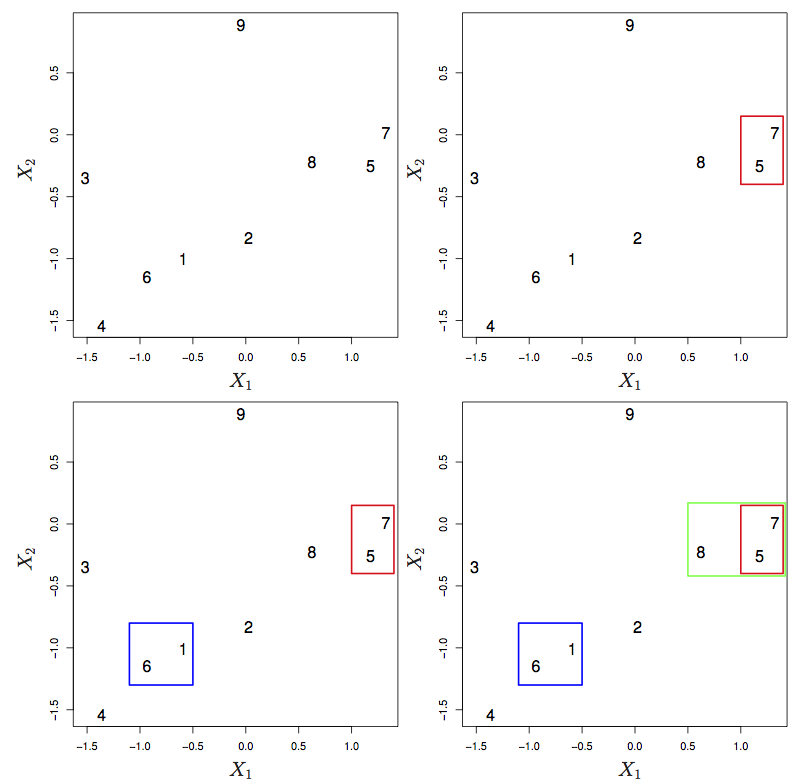

# Unsupervised learning

```{r include=FALSE}
require(mosaic)
require(ISLR)
require(DataComputing)
require(tidyverse)

knitr::opts_chunk$set(tidy=FALSE, fig.width=6, fig.height=4, out.width="5in")
```

# Clustering

## K-means

An EM algorithm approach.

```{r}
names(iris)
mod0 <- kmeans(iris %>% select(-Species), centers = 6)
To_plot <- iris
To_plot$cluster <- letters[mod0$cluster]
ggplot(To_plot, aes(x = Sepal.Length, y = Petal.Length, color = cluster, shape = Species)) +
  geom_point()
ggplot(To_plot, aes(x = Sepal.Length, y = Sepal.Width, color = cluster, shape = Species)) +
  geom_point()
```

```{r}
load("Blood-Cell-data.rda")
ggplot(Cells1, aes(x=x1, y=x2)) +
  geom_point()
```

```{r}
mod <- kmeans(Cells1 %>% select(x1, x2), centers=8)
Cells1$cluster <- letters[mod$cluster]
ggplot(Cells1, aes(x=x1, y=x2, color = cluster, shape = class)) +
  geom_point()
```


## Heirarchical clustering





**Linkage**

* Complete: maximum distance between points in the two clusters
* Single: minimal distance
* Average:
* Centroid: center-to-center distance.

## Example: Gene expression in cancer

```{r echo = FALSE, fig.margin=FALSE, fig.height = 9, fig.width=15,out.width="7in"}
require(DataComputing)
require(ggdendro)
Narrow <- 
  DataComputing::NCI60 %>%
  gather(value=expression, key=cellLine, -Probe) %>%
  group_by(Probe, cellLine) %>%
  summarise(expression = mean(expression)) %>% 
  ungroup()
Keepers <-
  Narrow %>% group_by(Probe) %>%
  filter(sd(expression) > 4.5) %>%
  spread(key=Probe, value=expression)
row.names(Keepers) <- Keepers$cellLine
Keepers <- Keepers %>% select(-cellLine)
scale_colour_discrete <- function(...) scale_colour_hue(...)
Dists <- dist(Keepers)
Dendrogram <- hclust(Dists)
Dots <- dendro_data(Dendrogram)$labels %>% mutate(label = as.character(label))
Dots <- Dots %>% extract(label, "cancer", "([[:alnum:]]+)")
ggdendrogram(Dendrogram) + 
  geom_point(data = Dots, size=4, aes(x=x, y=y, color = cancer)) +
  ggtitle("Complete Linkage")
Dendrogram <- hclust(Dists, method = "average")
Dots <- dendro_data(Dendrogram)$labels %>% mutate(label = as.character(label))
Dots <- Dots %>% extract(label, "cancer", "([[:alnum:]]+)")
ggdendrogram(Dendrogram) + 
  geom_point(data = Dots, size=4, aes(x = x, y = y, color = cancer)) +
  ggtitle("Average Linkage")
Dendrogram <- hclust(Dists, method = "single")
Dots <- dendro_data(Dendrogram)$labels %>% mutate(label = as.character(label))
Dots <- Dots %>% extract(label, "cancer", "([[:alnum:]]+)")
ggdendrogram(Dendrogram) + 
  geom_point(data = Dots, size=4, aes(x = x, y = y, color = cancer)) +
  ggtitle("Single Linkage")
```

# Principal components

Manifolds and planes

```{r}
# Get the party names
Parties <-  read.csv("VotesS1-tally.csv", as.is=TRUE, 
                      header=FALSE, nrows=1,
                     stringsAsFactors = FALSE )
# Get rid of the first column and turn into a vector.
Parties <- as.character(Parties[,-1])

Votes <- read.csv( "VotesS1-tally.csv", skip=1 )
Votes <- subset(Votes, complete.cases(Votes) )
rownames( Votes ) <- Votes$VOTE
Votes <- Votes[,-1]
memberNames <- names(Votes)
nBallots <- nrow( Votes )
VotesM <- matrix( unlist( Votes ), nrow=nBallots )
# VotesM <- VotesM[1:nBallots,1:ncol(Votes)] # drop the ballot names
# Put in alphabetical order
inds <- order( memberNames )
VAlpha <- VotesM[,inds]
Parties <- Parties[inds]
# remove <- which( apply( VAlpha, 2, function(x) sum(abs(x))) < 100 )
# memberNames <- memberNames[-remove]
# Parties <- Parties[-remove]
# Valpha <- VAlpha[,-remove]
res <- svd( VAlpha )
showVotes <- Votes[,inds]
a1 <- res$u[,1,drop=FALSE]
b1 <- res$v[,1,drop=FALSE] %>% t
a2 <- res$u[,2,drop=FALSE]
b2 <- res$v[,2,drop=FALSE] %>% t
library(reshape2) # for melt
melt( VAlpha ) %>% 
  mutate( Vote=factor(value, labels=c("Nay","Abstain","Aye"))) %>% 
  ggplot( aes(x=Var1, y=Var2, fill=Vote)) +
  geom_tile() +
  xlab("Ballot") + ylab("Member of Parliament") + 
  scale_fill_manual( values=c(rgb(.2,.2,.2,.6), rgb(.95,.95,.95), rgb(209/255,148/255,12/255)))
```

```{r fig.cap="\\label{fig:ballot-values} Positions of members of parliament on two ballots."}
Random2 <- data.frame( ballot48=VAlpha[48,], ballot118=VAlpha[118,] )
ggplot( Random2, aes(x=ballot48, y=ballot118)) +
  geom_point( alpha=.7, position=position_jitter(width = .1, height = .1) )+
  geom_point( alpha=.01, size=10, color="red" )
```
```{r echo=FALSE, fig.cap="\\label{fig:many-ballots} Positions of members of parliament on two ballot indices made up by the sum of groups of ballots."}
AllOfThem <- data.frame( First336=colSums( VAlpha[1:336,]), 
                         RemainingOnes=colSums(VAlpha[337:773,]))
ggplot( AllOfThem, aes(x=First336, y=RemainingOnes)) +
  geom_point( alpha=.7, size=5 )
```

```{r fig.cap="\\label{fig:ballot-PCA} The position of each member of Parliament using the two 'best' ways of summing the ballots."}
set.seed(101)
Best <- data.frame( one=c(b1), two=c(b2), three=res$v[,3], four=res$v[,4], five=res$v[,5] )
clusts <- kmeans( Best, centers=6)
Best$cluster <- as.factor(clusts$cluster)
# I lost the first member: Canavan.  Figure out later.
Best$actualParty <- Parties
ggplot( data=Best, aes( x=one, y=two )) +
    geom_point( shape=1, color='red', size=7, aes(x=0,y=0)) + 
  geom_point( size=5, alpha=.6, aes(color=cluster,shape=cluster) ) + 
  xlab("Best Vector from SVD") + 
  ylab("Next Best Vector from SVD") + 
  ggtitle("Political Positions of Members of Parliament")
```

```{r}
inds1 <- order(c(res$u[,1]))
inds2 <- order(c(res$v[,1]))
VA <- VAlpha[ inds1, inds2 ]
foo <- data.frame( vote=factor(c(t(VA)), labels=c("Nay","Abstain","Aye")), 
  y=rep(1:134,times=773),
  x=rep(1:773, each=134) )
ggplot( foo, aes(x=x, y=y, fill=vote)) +
  geom_tile() +
  xlab("Ballot") + ylab("Member of Parliament") + 
  scale_fill_manual( values=c(rgb(.2,.2,.2,.6), rgb(.95,.95,.95), rgb(209/255,148/255,12/255))) 
```