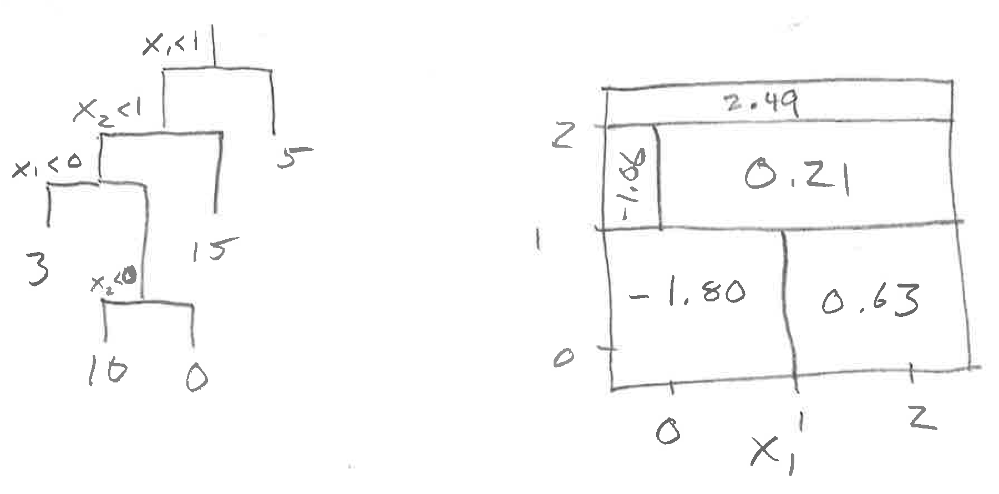

```{r setup, include=FALSE}
set.seed(103)
library(ISLR)
library(dplyr)
```

## ISL 8.4.1

Figures 8.1 and 8.2 provide a model.  The question is whether your two plots are consistent with one another.  Note that the dividing line at each node will be perpendicular to the axis of the variable used for splitting.

## ISL 8.4.2

## ISL 8.4.3

```{r}
classification_error <- function(p_1) 1 - pmax(p_1, 1 - p_1)
gini <- function(p_1) p_1 * (1 - p_1)
cross_entropy <- function(p_1) - (p_1 * log(p_1) + (1 - p_1) * log(1 - p_1))
x <- seq(0, 1, length = 1000)
plot(x, classification_error(x), type = "l", ylim = c(0, 0.75))
lines(x, gini(x), col = "blue")
lines(x, cross_entropy(x), col = "green")
```

## ISL 8.4.4




## ISL 8.4.5

The bootstrapped estimates of probability of "red" are:

```{r}
probs <- c(0.1, 0.15, 0.2, 0.2, 0.55, 0.6, 0.6, 0.65, 0.7, 0.75)
# majority_vote 
mean(probs > 0.5) # so red
# average probability
mean(probs) # so green
```

## ISL 8.4.12

A prediction of the number of bicyclists who will use a rail trail, using the `mosaicData::RailTrail` data

```{r}
data(RailTrail, package = "mosaicData") 
train_inds <- sample(nrow(RailTrail), size = nrow(RailTrail) / 2)
```

For each of the methods, the workflow is similar:    
1. Build the model using the training subset
2. Evaluate the model on the testing subset
3. Calculate the mean square prediction error for the testing subset

* Bagging

```{r}
library(randomForest)
set.seed(1101) # for reproducibility when debugging
bag_train <- randomForest(volume ~ . , data=RailTrail[train_inds,],
                          mtry = ncol(RailTrail) - 1, importance = TRUE)
preds <- predict(bag_train, newdata = RailTrail[ - train_inds, ])
mse_bag <- mean((RailTrail$volume[-train_inds] - preds)^2)
mse_bag
```

* Random Forests

```{r}
rf_train <- randomForest(volume ~ . , data=RailTrail[train_inds,],
                          mtry = ncol(RailTrail) / 3, importance = TRUE)
preds <- predict(rf_train, newdata = RailTrail[ - train_inds, ])
mse_rf <- mean((RailTrail$volume[-train_inds] - preds)^2)
mse_rf
```

* Boosting

```{r}
library(gbm)
boost_train <- gbm(volume ~ . , data=RailTrail[train_inds,],
                   distribution = "gaussian", n.trees = 5000, interaction.depth = 2)
preds <- predict(boost_train, newdata = RailTrail[ - train_inds, ], n.trees = 5000)
mse_boost <- mean((RailTrail$volume[-train_inds] - preds)^2)
mse_boost
```


* Linear Models

```{r}
lm_train <- lm(volume ~ . , data=RailTrail[train_inds,])
preds <- predict(lm_train, newdata = RailTrail[ - train_inds, ])
mse_lm <- mean((RailTrail$volume[-train_inds] - preds)^2)
mse_lm
```