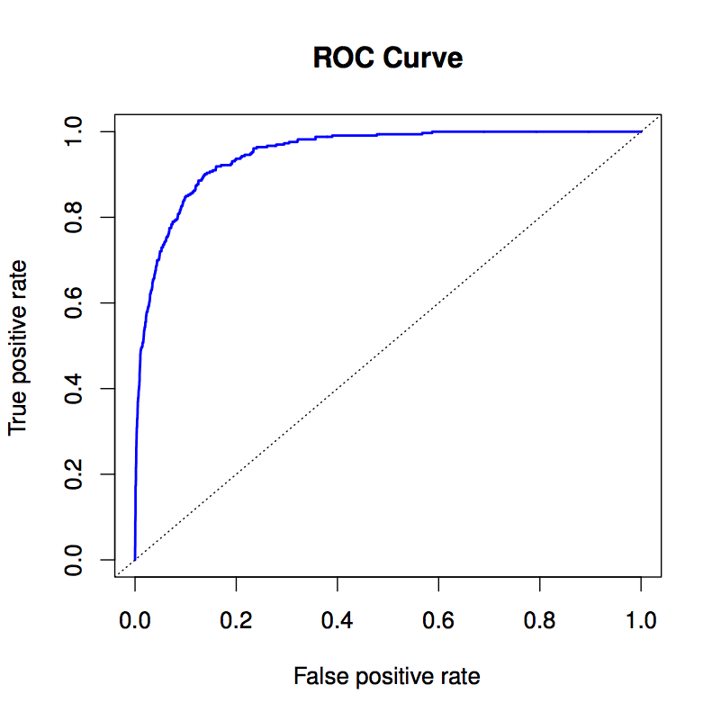
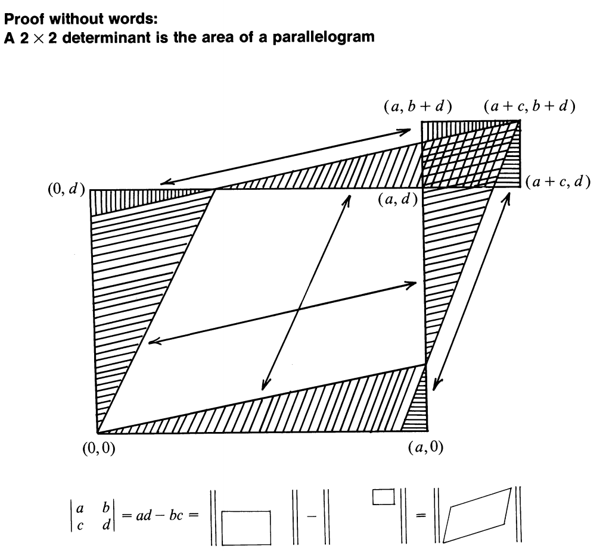
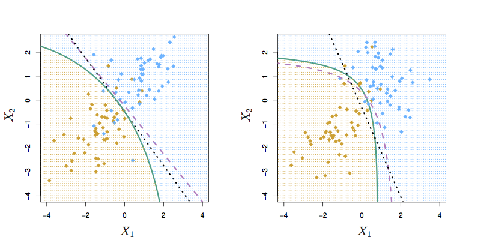
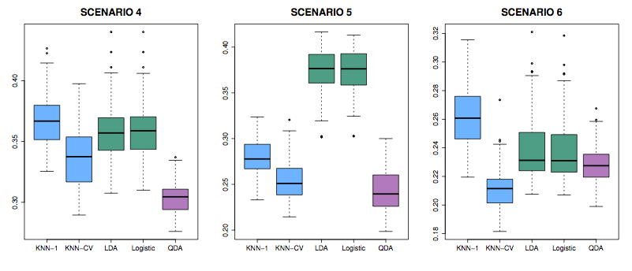

```{r include = FALSE}
require(mosaic)
require(ISLR)
require(MASS)
require(dplyr)
```


# Linear and Quadratic Discriminant Analysis


## Example: Default on student loans

```{r}
model_of_default2 <-
  lda(default ~ balance + income, data = Default)
model_of_default2

predict(model_of_default2, newdata = list(balance = 3000, income = 40000))
```

```{r}
sector_mod <- lda(sector ~ wage + educ, data = CPS85)
sector_mod
predict(sector_mod, newdata = list(wage = 10, educ = 16))
all_combos <- expand.grid(wage = seq(0,20,length=100), educ = seq(5,16, length = 100))
res <- predict(sector_mod, newdata = all_combos)$class
all_combos$predicted <- res
ggplot(all_combos, aes(x = wage, y = educ, color = predicted)) + geom_point()
```

## A Bayes' Rule approach

Suppose we have $K$ classes, $A_1, A_2, \ldots, A_K$.  We also have a set of inputs $x_1, x_2, \ldots, x_p \equiv {\mathbf x}$. 

We observe ${\mathbf x}$ and we want to know $p(A_j \downarrow {\mathbf x})$. This is a *posterior* probability.

Per usual, the quantities we can get from our training data are in the form of a *likelihood*: $p({\mathbf x} \downarrow A_j)$. 

Given a *prior* $p(A_j)$ for all K classes, we can flip the likelihood into a posterior.

In order to define our likelihood $p({\mathbf x} \downarrow A_j)$, we need both the training data and a model form for the probability $p()$.

A standard (but not necessarily good) model of a distribution is a multivariate Gaussian.
LDA and QDA are based on a multi-variable Gaussian.


## Univariate Gaussian

$$p(x) = \underbrace{\frac{1}{\sqrt{2 \pi \sigma^2}}}_{Normalization} \underbrace{\exp(- \frac{(x-m)^2}{2 \sigma^2})}_{Shape}$$

Imagine that we have another variable $z = x/3$. Geometrically, $z$ is a stretched out version of $x$, stretched by a factor of 3 around the mean.  The distribution is

$$p(z) = \underbrace{\frac{1}{\sqrt{2 \pi (3\sigma)^2}}}_{Normalization}\ \underbrace{\exp(- \frac{(x-m)^2}{2 (3\sigma)^2})}_{Shape}$$

Note how the normalization changes.  $p(z)$ is broader than $p(x)$, so it must also be shorter.

The R function `dnorm()` calculates $p(x)$ for a univariate Gaussian.

## Uncorrelated bivariate gaussian

For independent RVs x and y, p(xy) = p(x)p(y).  Show that the normalization is
$\frac{1}{2 \pi \sigma_x \sigma_y}$.

The sigmas multiply in the normalization, like the area of something being stretched out in two orthogonal directions.


## Bivariate normal distribution with correlations


$$f(x,y) =
      \frac{1}{2 \pi  \sigma_X \sigma_Y \sqrt{1-\rho^2}}
      \exp\left(
        -\frac{1}{2(1-\rho^2)}\left[
          \frac{(x-\mu_X)^2}{\sigma_X^2} +
          \frac{(y-\mu_Y)^2}{\sigma_Y^2} -
          \frac{2\rho(x-\mu_X)(y-\mu_Y)}{\sigma_X \sigma_Y}
        \right]
      \right)$$

If $\rho > 0$ and $x$ and $y$ are both above their respective means, the correlation term makes the result *less* surprising: a larger probability.

Another way of writing this same formula is using a covariate matrix ${\boldsymbol\Sigma}$.


Or, in matrix form


$$(2\pi)^{-\frac{k}{2}}|\boldsymbol\Sigma|^{-\frac{1}{2}}\, \exp\left( -\frac{1}{2}(\mathbf{x}-\boldsymbol\mu)'\boldsymbol\Sigma^{-1}(\mathbf{x}-\boldsymbol\mu) \right)$$

where $$\boldsymbol \Sigma \equiv \left(\begin{array}{cc}\sigma_x^2 & \rho \sigma_x \sigma_y\\\rho\sigma_x\sigma_y& \sigma_y^2\end{array} \right)$$

Therefore
$$\boldsymbol \Sigma^{-1} \equiv  \frac{1}{\sigma_x^2 \sigma_y^2 (1 - \rho^2)} \left(\begin{array}{cc}\sigma_y^2 & - \rho \sigma_x \sigma_y\\ - \rho\sigma_x\sigma_y& \sigma_x^2\end{array} \right)$$


## Shape of multivariate gaussian

As an amplitude plot


Showing marginals and 3-$\sigma$ contour 


## Generating bivariate normal from independent

We want to find a matrix, M, by which to multiply iid Z to get correlated X with specified $\sigma_x, \sigma_y, \rho$.  The covariance matrix will be


```{r}
# parameters
sigma_x <- 3
sigma_y <- 1
rho <- 0.5
Sigma <- matrix(c(sigma_x^2, rho * sigma_x * sigma_y, rho * sigma_x * sigma_y, sigma_y^2), nrow = 2)
n <- 5000 # number of simulated cases
# iid base
Z <- cbind(rnorm(n), rnorm(n))
M <- matrix(c(sigma_x, 0, rho * sigma_y, sqrt(1-rho^2)* sigma_y), nrow = 2)
X <- Z %*% M
cov(X)
```

M transforms from iid to correlated. 

In formula, we transform from correlated X to iid, so use M$^{-1}$.


## Independent variables $x_i$

* Describing dependence

```{r}
x1 = runif(1000)
x2 = rnorm(1000, mean=3*x1+2, sd=x1)
plot(x1, x2)
```

* Linear correlations and the Gaussian

Remember the univariate Gaussian with parameters $\mu$ and $\sigma^2$:    
$$\frac{1}{\sqrt{2 \pi \sigma^2}} \exp \left(-\frac{(x - \mu)^2}{2 \sigma^2}\right)$$

Situation: Build a classifier.  We measure some features and want to say which group a case refers to.

Specific example: Based on the `ISLR::Default` data, find the probability of a person defaulting on a loan given their `income` and `balance`. 

```{r fig.width=8, fig.height=8, out.width = "6in"}
names(Default)
ggplot(Default, 
       aes(x = income, y = balance, alpha = default, color = default)) + 
  geom_point()
```

We were looking at the likelihood: prob(observation | class)

Note: Likelihood itself won't do a very good job, since defaults are relatively uncommon. That is, p(default) $\ll$ p(not).

## Re-explaining $\boldsymbol\Sigma$

```{r echo=FALSE, fig.cap="Figure 4.8 from ISL"}

```


Imagine two zero-mean variables, $x_i$ and $x_j$, e.g. education and age, and suppose that $v_i = x_i - \mu_i$ and $v_j = x_j - \mu_j$. I'll write these in data table format, where each column is a variable and each row is a case and denote this by

$\left(\begin{array}{c}v_i\\\downarrow\end{array}\right)$ and 
$\left(\begin{array}{c}v_j\\\downarrow\end{array}\right)$

Correlations between random variables $(v_i, v_j)$ are created by overlapping sums of zero-mean iid random variables $(z_i, z_j)$, 

$$\left(\begin{array}{cc}v_i &v_j\\\downarrow & \downarrow\end{array}\right) =  \left(\begin{array}{cc}z_i & z_j \\ \downarrow & \downarrow\end{array}\right) \left(\begin{array}{cc}a & b\\0 & c\end{array}\right)
\equiv \left(\begin{array}{cc}z_i & z_j\\\downarrow & \downarrow\end{array}\right) {\mathbf A}  $$

and add in a possibly non-zero mean to form each $x$.
$$\left(\begin{array}{cc}x_i &x_j\\\downarrow&\downarrow\end{array}\right) = \left(\begin{array}{cc}v_i & v_j\\\downarrow&\downarrow\end{array}\right) + \left(\begin{array}{cc}m_i & m_j\\\downarrow&\downarrow\end{array}\right) $$
where each of $\left(\begin{array}{c}m_i\\|\end{array}\right)$ and
$\left(\begin{array}{c}m_i\\|\end{array}\right)$ have every row the same.

The covariance matrix $\boldsymbol\Sigma$ is 

$${\boldsymbol \Sigma} \equiv \frac{1}{n} \left(\begin{array}{cc}v_i & v_j\\\downarrow&\downarrow\end{array}\right)^T \left(\begin{array}{cc}v_i & v_j\\\downarrow&\downarrow\end{array}\right)
= \frac{1}{n} \left(\begin{array}{c}v_i  \longrightarrow\\v_j \longrightarrow\end{array}\right)
 \left(\begin{array}{cc}v_i & v_j\\\downarrow&\downarrow\end{array}\right) $$

Substituting in 

$$ \left(\begin{array}{cc}v_i &v_j\\\downarrow & \downarrow\end{array}\right) =  \left(\begin{array}{cc}z_i & z_j\\\downarrow & \downarrow\end{array}\right) {\mathbf A}  $$
we get

$${\boldsymbol \Sigma} = \frac{1}{n}
\left[\left(\begin{array}{cc}z_i & z_j\\\downarrow & \downarrow\end{array}\right) {\mathbf A} \right]^T \left(\begin{array}{cc}z_i & z_j\\\downarrow & \downarrow\end{array}\right) {\mathbf A} = \frac{1}{n} {\mathbf A}^T \left(\begin{array}{c}z_i \longrightarrow\\z_j \longrightarrow\end{array}\right)
\left(\begin{array}{cc}z_i & z_j\\\downarrow & \downarrow\end{array}\right) {\mathbf A}$$

Now $\left(\begin{array}{cc}z_i & z_j\\\downarrow & \downarrow\end{array}\right)$ are iid with zero mean and unit variance, so 
$$\left(\begin{array}{c}z_i \longrightarrow\\z_j \longrightarrow\end{array}\right)
\left(\begin{array}{cc}z_i & z_j\\\downarrow & \downarrow\end{array}\right) = \left(\begin{array}{cc}1 & 0\\0 & 1\end{array}\right)$$
so ${\boldsymbol \Sigma} = {\boldsymbol A}^T {\boldsymbol A}$.

In other words, $\boldsymbol A$ is the Choleski decomposition of $\boldsymbol \Sigma$.

Operationalizing this in R

* Find $\boldsymbol \Sigma$ from data: `cov(data)`, e.g.
```{r}
library(dplyr)
Sigma <- cov(ISLR::Default %>% dplyr::select(balance, income))
Sigma
```
* Find $\boldsymbol A$ from $\boldsymbol \Sigma$
```{r}
A <- chol(Sigma)
A
```

* Generate iid $\left(\begin{array}{cc}z_i&z_j\\\downarrow&\downarrow\end{array}\right)$ with unit variance
```{r}
n <- 100 # say
Z <- cbind(rnorm(n), rnorm(n))
```

* Create the correlated $\left(\begin{array}{cc}v_i&v_j\\\downarrow&\downarrow\end{array}\right)$ from $\left(\begin{array}{cc}z_i&z_j\\\downarrow&\downarrow\end{array}\right)$
```{r}
V <- Z %*% A
```

* Create a set of means $\left(\begin{array}{cc}m_i&m_j\\\downarrow&\downarrow\end{array}\right)$ to add on to $\left(\begin{array}{cc}v_i&v_j\\\downarrow&\downarrow\end{array}\right)$
```{r}
M <- cbind(rep(3, n), rep(-2, n))
head(M)
```

* Add $\left(\begin{array}{cc}m_i&m_j\\\downarrow&\downarrow\end{array}\right)$ to $\left(\begin{array}{cc}v_i&v_j\\\downarrow&\downarrow\end{array}\right)$ to create $\left(\begin{array}{cc}x_i&x_j\\\downarrow&\downarrow\end{array}\right)$
```{r}
X <- V + M
```

* Find the covariance matrix for $\left(\begin{array}{cc}x_i&x_j\\\downarrow&\downarrow\end{array}\right)$
```{r}
cov(X)
```

Why isn't this exactly the same as the covariance matrix $\boldsymbol \Sigma$ that we were aiming at? Because of random fluctuations in the $\left(\begin{array}{cc}z_i&z_j\\\downarrow&\downarrow\end{array}\right)$. You can reduce the impact of those fluctuations by making $n$ bigger.

Notice that ${\boldsymbol A}$ transforms from uncorrelated $\left(\begin{array}{cc}z_i&z_j\\\downarrow&\downarrow\end{array}\right)$ to correlated $\left(\begin{array}{cc}v_i&v_j\\\downarrow&\downarrow\end{array}\right)$.
If we have $\left(\begin{array}{cc}x_i&x_j\\\downarrow&\downarrow\end{array}\right)$, we can create the uncorrelated $\left(\begin{array}{cc}z_i&z_j\\\downarrow&\downarrow\end{array}\right)$ with
$$\left(\begin{array}{cc}z_i&z_j\\\downarrow&\downarrow\end{array}\right) =
\left[\left(\begin{array}{cc}x_i&x_j\\\downarrow&\downarrow\end{array}\right) - 
\left(\begin{array}{cc}m_i&m_j\\\downarrow&\downarrow\end{array}\right)\right] {\boldsymbol A}^{-1}$$.

Recall
$$(2\pi)^{-\frac{k}{2}}|\boldsymbol\Sigma|^{-\frac{1}{2}}\, \exp\left( -\frac{1}{2}(\mathbf{x}-\boldsymbol\mu)^T\boldsymbol\Sigma^{-1}(\mathbf{x}-\boldsymbol\mu) \right)$$.

Since $\boldsymbol\Sigma = \boldsymbol A^T \boldsymbol A$ and $x_i - m = v_i$, this formula is equivalent to
$$(2\pi)^{-\frac{k}{2}}|\boldsymbol\Sigma|^{-\frac{1}{2}}\, \exp\left( -\frac{1}{2}(\mathbf{v}^{T}\boldsymbol A^{-T} \boldsymbol A^{-1} \mathbf v) \right) = 
(2\pi)^{-\frac{k}{2}}|\boldsymbol\Sigma|^{-\frac{1}{2}}\, \exp\left( -\frac{1}{2}(\mathbf{z}^{T}\mathbf z) \right)$$
Now for a pair of values like $\mathbf x = (x_1 \ \ x_2)$ finding the probability of $\mathbf x$ corresponds to finding the corresponding $\mathbf z^T = (z_i\ \ z_j)$, where $z_i$ and $z_j$ are each a random scalars, and 
$(\mathbf{z}^{T}\mathbf z) = z_i^2 + z_2^2$, so the probability is

$$(2\pi)^{-\frac{k}{2}}|\boldsymbol\Sigma|^{-\frac{1}{2}}\, \exp\left( -\frac{1}{2}(z_1^2 + z_2^2 )\right) = 
(2\pi)^{-\frac{k}{2}}|\boldsymbol\Sigma|^{-\frac{1}{2}}\, \exp(-\frac{z_1^2}{2}) \exp(-\frac{z_2^2}{2})$$

Look at the stretching that goes on due to a matrix:

```{r echo = FALSE}

```

[figure source](http://www.maa.org/programs/faculty-and-departments/classroom-capsules-and-notes/proof-without-words-a-2-x-2-determinant-is-the-area-of-a-parallelogram)

The stretching is due to the matrix $\boldsymbol A$. So we should divide by the determinant of $\boldsymbol A$, that is, $|\boldsymbol A|$. The nature of the Cholesky decomposition is that $|\boldsymbol A| = \sqrt{|\boldsymbol\Sigma|}$. Note in the formula for the Gaussian that the normalizing constant involves $\sqrt{|\boldsymbol\Sigma|}$.

## LDA

All classes are treated as having the same ${\mathbf \Sigma}$.

\includegraphics[width=\textwidth]{../ISL-Book-Figures/Chapter4/{4.6}.pdf}
\marginnote[-2cm]{Figure 4.6 from ISL}

## QDA

Classes are treated with different  ${\mathbf \Sigma}_i$.

```{r fig.cap="Figure 4.9 from ISL. Left: Bayes (purple dashed), LDA (black dotted), and QDA (green solid)} decision boundaries for a two-class problem with ${\\mathbf \\Sigma}_1 = {\\mathbf \\Sigma}_2$.  Right: QDA"}

```

## Error test rates on various classifiers

```{r echo=FALSE,fig.cap="Figure 4.10 from ISL"}
knitr::include_graphics("Images/Chapter-4/4.10.png")
```

Scenarios: In all, class means are different.

1. Each class is two uncorrelated Gaussian random vars. 
2. Both classes had a correlation of $-0.5$
3. Uncorrelated, like (1), but the distribution is t(df=?): long tailed to right.

```{r echo=FALSE,fig.cap="Figure 4.11 from ISL"}

```

4. Like (2), but one class has $\rho = 0.5$ and the other $\rho = -0.5$
5. A nonlinear predictor with $X_1^2$, $X_2^2$, $X_1 \times X_2$ giving a quadratic decision boundary
6. A decision boundary more complicated than a quadratic.

## Error rates

Ways to measure the performance of a classifier.

Examples: Two classifiers of employment type.

```{r}
data(CPS85, package = "mosaicData")
classifier_1 <- lda(sector ~ wage + educ + age, data = CPS85)
classifier_2 <- qda(sector ~ wage + educ + age, data = CPS85)
```

* Confusion matrix
```{r}
table(CPS85$sector, predict(classifier_1)$class)
```
* Rates for right-vs-wrong.
    - Accuracy. Total error rate. Not generally useful, because there are two ways to be wrong.
    ```{r}
    table(predict(classifier_1)$class == CPS85$sector) / nrow(CPS85)
    ```
    - Sensitivity: If the real class is X, the probability that the classifier will produce an output of X.
        We need to choose the output we care about. Let's use `prof`.
    ```{r}
    is_prof <- CPS85$sector == "prof"
    predicts_prof <- predict(classifier_1)$class == "prof"
    table(is_prof, predicts_prof) 
    ```
    105 actual `prof`, of which 81 were correctly classified. So, sensitivity is 81/105.
    - Specificity: If the real class is **not** X, the probability that the classifier will output not X.
    See above table. 429 not `prof`, of which 354 were correctly classified. So specificity is 354/429.
* Loss functions
    - Social awkwardness of thinking someone is in the wrong profession.

## Receiver operating curves

There's always one or more parameters that can be set in a classifier. This might be as simple as the prior probability.

As this parameter is changed, typically sensitivity will go up at the cost of specificity, or *vice versa*.

President Garfield's assassination.

# Example: Blood Cells

```{r echo = FALSE}
load("/Users/kaplan/Dropbox/Projects/Consulting/Ativamed/Ativamed/AtivamedPackage/data/good_set1.rda")
library(dplyr)
Cells <- good_set1 %>%
  rename(X = SALS, Y = FALS, Type = GatingCode) %>%
  mutate(Type = as.character(Type))
```

```{r}
library(ggplot2)
library(MASS)
Cells %>%
  ggplot(aes(x = X, y = Y)) + geom_point(aes(color = Type))
mod <- qda(Type ~ X + Y, data = Cells)
Grid <- expand.grid(X = seq(2590, 66000, length = 151), Y = seq(11000,65000, length = 151))
preds_in <- predict(mod)
preds <- predict(mod, newdata = Grid)
Grid$class <- preds$class
Grid %>% 
  ggplot(aes(x = X, y = Y)) + geom_point(aes(color=class), alpha = .1) + 
  geom_point(data = Cells, aes(x = X, y = Y, color = Type), alpha = .1)
table(Cells$Type, preds_in$class)
```


